# Friendship and Cooperation Association — System Architecture
# جمعية الصداقة والتعاون — وثيقة الهيكلة المعمارية للنظام

> [!IMPORTANT]
> This document is the **complete technical architecture** for the platform. **No code will be generated** until this document is reviewed and approved.

---

## Table of Contents

1. [Phase 1 — System Analysis](#phase-1--system-analysis)
2. [Phase 2 — System Modules](#phase-2--system-modules)
3. [Phase 3 — Database Design](#phase-3--database-design)
4. [Phase 4 — API Architecture](#phase-4--api-architecture)
5. [Phase 5 — Frontend Architecture](#phase-5--frontend-architecture)
6. [Phase 6 — Microservice Architecture](#phase-6--microservice-architecture)
7. [Phase 7 — DevOps](#phase-7--devops)
8. [Project Structure](#project-structure)
9. [Development Roadmap](#development-roadmap)
10. [Complexity Estimates](#complexity-estimates)

---

# Phase 1 — System Analysis

## 1.1 Full Domain Analysis

The **Friendship and Cooperation Association (جمعية الصداقة والتعاون)** is a large non-profit educational and development organization. Its core mission revolves around:

| Domain Area | Description |
|---|---|
| **Scholarship Management** | Receiving, evaluating, and awarding scholarships to university students across multiple academic years and disciplines. |
| **Student Housing** | Managing residential housing for students — room allocation, rent tracking, maintenance, occupancy lifecycle. |
| **Innovation & Conferences** | Organizing annual innovation competitions and academic conferences — project submissions, judging panels, awards. |
| **Donor Relations** | Managing relationships with international donors — fundraising campaigns, donation tracking, fund allocation, transparency reports. |
| **Research Support** | Supporting researchers through grants, publication tracking, and research project management. |
| **Financial Operations** | Internal financial auditing, budget management, expense tracking, and fund allocation across programs. |
| **Inventory & Assets** | Tracking organizational assets — equipment, supplies, facility inventory. |
| **Reporting & Analytics** | Cross-module dashboards, KPIs, exportable reports for internal leadership and external stakeholders. |

### Domain Boundaries

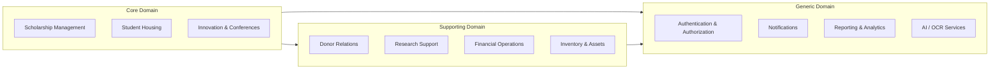

---

## 1.2 Business Modules (Summary)

| # | Module | Priority | Domain |
|---|---|---|---|
| 1 | Authentication & Authorization | P0 | Generic |
| 2 | User Management | P0 | Generic |
| 3 | Scholarship Management | P0 | Core |
| 4 | Student Housing | P0 | Core |
| 5 | Innovation & Conference | P1 | Core |
| 6 | Judges Portal | P1 | Core |
| 7 | Donor Portal | P1 | Supporting |
| 8 | Financial Auditing | P1 | Supporting |
| 9 | Research Management | P2 | Supporting |
| 10 | Inventory Management | P2 | Supporting |
| 11 | OCR Processing (AI) | P1 | Generic |
| 12 | Candidate Ranking (AI) | P1 | Generic |
| 13 | Notifications | P0 | Generic |
| 14 | Reporting & Analytics | P2 | Generic |
| 15 | File & Document Management | P0 | Generic |
| 16 | Audit & Logging | P0 | Generic |

---

## 1.3 User Types

| User Type | Arabic | Description | Estimated Count |
|---|---|---|---|
| **Super Admin** | مدير النظام | Full system control, configuration, user provisioning | 2–5 |
| **Admin** | مسؤول | Module-scoped administration (e.g., scholarship admin, housing admin) | 10–30 |
| **Student** | طالب | Applies for scholarships, housing; participates in competitions | 5,000–20,000 |
| **Scholarship Applicant** | متقدم للمنحة | Student subset — active scholarship application in progress | 1,000–5,000/cycle |
| **Housing Resident** | مقيم في السكن | Student subset — currently assigned housing | 200–1,000 |
| **Researcher** | باحث | Submits research proposals, tracks grants, publishes results | 100–500 |
| **Innovation Participant** | مشارك في المسابقة | Submits innovation projects for judging | 200–1,000/event |
| **Judge** | محكم | Evaluates scholarship applications, innovation projects | 20–100 |
| **Donor** | متبرع | International or local donor — views campaigns, donates, tracks impact | 50–500 |
| **Financial Auditor** | مدقق مالي | Reviews financial transactions, generates audit reports | 3–10 |
| **Viewer / Guest** | زائر | Public-facing pages, campaign viewing, read-only access | Unlimited |

---

## 1.4 Permissions Matrix

### RBAC Model: Role → Permission → Resource

```
SuperAdmin > Admin > ModuleAdmin > User > Guest
```

| Permission | Super Admin | Admin | Scholarship Admin | Housing Admin | Judge | Student | Donor | Auditor | Guest |
|---|---|---|---|---|---|---|---|---|---|
| Manage all users | ✅ | ❌ | ❌ | ❌ | ❌ | ❌ | ❌ | ❌ | ❌ |
| Manage module users | ✅ | ✅ | ✅ (own module) | ✅ (own module) | ❌ | ❌ | ❌ | ❌ | ❌ |
| Configure system settings | ✅ | ❌ | ❌ | ❌ | ❌ | ❌ | ❌ | ❌ | ❌ |
| View all scholarships | ✅ | ✅ | ✅ | ❌ | ✅ (assigned) | ❌ | ❌ | ✅ | ❌ |
| Create scholarship cycle | ✅ | ✅ | ✅ | ❌ | ❌ | ❌ | ❌ | ❌ | ❌ |
| Submit scholarship app | ❌ | ❌ | ❌ | ❌ | ❌ | ✅ | ❌ | ❌ | ❌ |
| Evaluate application | ❌ | ❌ | ✅ | ❌ | ✅ | ❌ | ❌ | ❌ | ❌ |
| Manage housing | ✅ | ✅ | ❌ | ✅ | ❌ | ❌ | ❌ | ❌ | ❌ |
| Apply for housing | ❌ | ❌ | ❌ | ❌ | ❌ | ✅ | ❌ | ❌ | ❌ |
| Submit innovation project | ❌ | ❌ | ❌ | ❌ | ❌ | ✅ | ❌ | ❌ | ❌ |
| Judge innovation project | ❌ | ❌ | ❌ | ❌ | ✅ | ❌ | ❌ | ❌ | ❌ |
| View donations | ✅ | ✅ | ❌ | ❌ | ❌ | ❌ | ✅ (own) | ✅ | ❌ |
| Make donation | ❌ | ❌ | ❌ | ❌ | ❌ | ❌ | ✅ | ❌ | ✅ |
| View financial reports | ✅ | ✅ | ❌ | ❌ | ❌ | ❌ | ❌ | ✅ | ❌ |
| View analytics | ✅ | ✅ | ✅ (own module) | ✅ (own module) | ❌ | ❌ | ❌ | ✅ | ❌ |
| Export reports | ✅ | ✅ | ✅ | ✅ | ❌ | ❌ | ❌ | ✅ | ❌ |

### Permission Architecture

- **RBAC** (Role-Based Access Control) for coarse-grained access.
- **ABAC** (Attribute-Based Access Control) for fine-grained rules (e.g., "Judge can only see applications assigned to them", "Student can only edit own application before deadline").
- Permissions stored in DB, cached in Redis, validated at the Go middleware layer.

---

## 1.5 Functional Requirements

### FR-AUTH: Authentication & Authorization
- FR-AUTH-01: Email/password registration with email verification
- FR-AUTH-02: JWT access + refresh token flow
- FR-AUTH-03: OAuth2 integration (Google) for students
- FR-AUTH-04: Role-based route protection (frontend + backend)
- FR-AUTH-05: Session revocation and forced logout
- FR-AUTH-06: Password reset via email OTP
- FR-AUTH-07: Rate-limited login attempts (brute-force protection)

### FR-SCH: Scholarship Management
- FR-SCH-01: Admin creates scholarship cycles with configurable deadlines, criteria, and quotas
- FR-SCH-02: Student submits multi-step application (personal data, academic records, documents)
- FR-SCH-03: OCR engine extracts text from uploaded academic transcripts
- FR-SCH-04: AI ranking engine scores and ranks candidates based on weighted criteria
- FR-SCH-05: Judge reviews and scores assigned applications via evaluation rubric
- FR-SCH-06: Admin publishes results; students notified
- FR-SCH-07: Historical view of all past scholarship cycles
- FR-SCH-08: Application status tracking (draft → submitted → under-review → evaluated → accepted/rejected)

### FR-HSG: Student Housing
- FR-HSG-01: Admin defines buildings, floors, rooms, capacities
- FR-HSG-02: Student applies for housing with required documents
- FR-HSG-03: Admin allocates rooms (manual or AI-assisted ranking)
- FR-HSG-04: Resident tracks rent payments and maintenance requests
- FR-HSG-05: Check-in / check-out lifecycle management
- FR-HSG-06: Occupancy dashboard with real-time availability
- FR-HSG-07: Violation tracking and warnings

### FR-INN: Innovation & Conference
- FR-INN-01: Admin creates competition events with categories and deadlines
- FR-INN-02: Participant submits project (description, media, team members)
- FR-INN-03: Judge panel assigned per category
- FR-INN-04: Multi-criteria scoring rubric per event
- FR-INN-05: Leaderboard and results publication
- FR-INN-06: Certificate generation for winners

### FR-DON: Donor Portal
- FR-DON-01: Public campaign pages with progress tracking
- FR-DON-02: Donor registration and profile management
- FR-DON-03: One-time and recurring donation processing
- FR-DON-04: Donation receipt generation (PDF)
- FR-DON-05: Impact reports visible to donors
- FR-DON-06: Fund allocation transparency dashboard

### FR-FIN: Financial Auditing
- FR-FIN-01: Record all financial transactions (income, expenses, transfers)
- FR-FIN-02: Budget allocation per program/module
- FR-FIN-03: Expense approval workflows
- FR-FIN-04: Auditor-specific view with filters and export
- FR-FIN-05: Monthly/quarterly/annual financial summary reports

### FR-INV: Inventory Management
- FR-INV-01: Track assets (equipment, furniture, supplies)
- FR-INV-02: Asset assignment to rooms, departments, or individuals
- FR-INV-03: Maintenance and depreciation tracking
- FR-INV-04: Low-stock alerts

### FR-RES: Research Management
- FR-RES-01: Researcher submits grant proposals
- FR-RES-02: Review and approval workflow
- FR-RES-03: Milestone tracking and progress reports
- FR-RES-04: Publication and output tracking

### FR-RPT: Reporting & Analytics
- FR-RPT-01: Role-specific dashboards with KPIs
- FR-RPT-02: Cross-module aggregated analytics
- FR-RPT-03: Exportable reports (PDF, Excel)
- FR-RPT-04: Date-range filtering, comparisons

### FR-NOTIF: Notifications
- FR-NOTIF-01: In-app notification center
- FR-NOTIF-02: Email notifications for critical events
- FR-NOTIF-03: Notification preferences per user
- FR-NOTIF-04: Batch notifications for admin announcements

---

## 1.6 Non-Functional Requirements

| Category | Requirement | Target |
|---|---|---|
| **Performance** | API response time (P95) | < 200ms |
| **Performance** | Dashboard load time | < 2s |
| **Performance** | Concurrent users | 5,000+ simultaneous |
| **Availability** | Uptime SLA | 99.5% |
| **Scalability** | Horizontal scaling | Stateless Go API behind load balancer |
| **Scalability** | Database | Read replicas, connection pooling (pgbouncer) |
| **Data Retention** | Historical data | 10+ years of scholarship and financial records |
| **Localization** | Languages | Arabic (RTL) primary, English secondary |
| **Accessibility** | WCAG | Level AA compliance |
| **Browser Support** | Targets | Chrome, Firefox, Safari, Edge (last 2 versions) |
| **Mobile** | Responsive | Full mobile-responsive design |

---

## 1.7 Security Requirements

| # | Requirement | Implementation |
|---|---|---|
| SEC-01 | Authentication | JWT (short-lived access + long-lived refresh), httpOnly cookies |
| SEC-02 | Password Storage | bcrypt with cost factor 12 |
| SEC-03 | Input Validation | Zod (frontend) + Go struct validation (backend) |
| SEC-04 | SQL Injection | Parameterized queries via pgx — no string concatenation |
| SEC-05 | XSS Prevention | React's built-in escaping + CSP headers |
| SEC-06 | CSRF | SameSite cookies + CSRF token for mutations |
| SEC-07 | Rate Limiting | Redis-based sliding window — per IP and per user |
| SEC-08 | File Upload | Whitelist extensions, max size (10MB), virus scan |
| SEC-09 | Audit Trail | Every mutation logged with user ID, timestamp, IP, old/new values |
| SEC-10 | Data Encryption | TLS 1.3 in transit; AES-256 at rest for sensitive fields |
| SEC-11 | CORS | Strict origin whitelist |
| SEC-12 | Secrets Management | Environment variables, never in code; Docker secrets in production |
| SEC-13 | Dependency Scanning | GitHub Dependabot + Snyk for Go, npm, pip |

---

## 1.8 Scalability Requirements

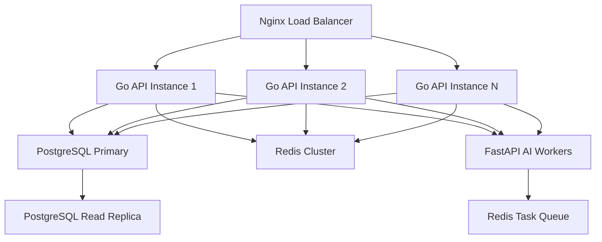

| Layer | Strategy |
|---|---|
| **API** | Stateless Go services; horizontal scaling via Docker Compose replicas or Kubernetes |
| **Database** | Primary + read replicas; connection pooling via pgbouncer; table partitioning for high-volume tables |
| **Cache** | Redis for sessions, permissions, rate limits, frequently-read data |
| **AI Workers** | Async task queue (Redis); scale workers independently |
| **File Storage** | Object storage (S3-compatible, e.g., MinIO) for documents and media |
| **CDN** | Static assets served via CDN (CloudFlare or similar) |

---

## 1.9 AI Service Responsibilities

The **FastAPI AI Worker** handles two primary workloads:

### 1.9.1 OCR Processing Engine

| Aspect | Detail |
|---|---|
| **Purpose** | Extract structured text from scanned academic transcripts, ID cards, certificates |
| **Input** | Image or PDF uploaded by student |
| **Pipeline** | Pre-processing (deskew, denoise) → OCR (Tesseract / PaddleOCR) → Post-processing (field extraction via regex/NLP) |
| **Output** | Structured JSON: student name, GPA, university, major, year |
| **Trigger** | Async — Go API enqueues task in Redis; AI worker picks up |
| **Storage** | Extracted data saved to `ocr_results` table; linked to original document |
| **Fallback** | If confidence < threshold → flag for manual review |

### 1.9.2 Candidate Ranking Engine

| Aspect | Detail |
|---|---|
| **Purpose** | Score and rank scholarship/housing applicants based on weighted multi-criteria evaluation |
| **Input** | Applicant data (GPA, income, distance, family size, special circumstances) + scholarship criteria weights |
| **Algorithm** | Weighted scoring model (configurable weights per cycle); optional ML model for anomaly detection |
| **Output** | Ranked list with scores, per-criterion breakdown, confidence |
| **Trigger** | On-demand — admin triggers ranking for a cycle; or scheduled batch |
| **Fairness** | Bias audit log; criteria transparency; admin can override individual rankings |
| **Integration** | Results written to `ranking_results` table; surfaced in admin and judge dashboards |

---

# Phase 2 — System Modules

## Module 1: Authentication & Authorization

### Purpose
Central identity management — user registration, login, session lifecycle, role assignment, and permission enforcement.

### Key Components
- **Registration Service**: Email/password signup with verification; OAuth2 (Google) for students
- **Login Service**: Credential validation → JWT issuance (access token: 15 min, refresh token: 7 days)
- **Token Manager**: Issue, refresh, revoke, blacklist (Redis-backed)
- **Permission Engine**: RBAC role → permissions mapping; ABAC rules for resource-scoped access
- **Middleware**: Chi middleware for JWT validation, role extraction, permission checking on every request

### Data Entities
- `users`, `roles`, `permissions`, `role_permissions`, `user_roles`, `refresh_tokens`, `login_attempts`

### Integrations
- Redis: token blacklist, session cache, rate limiting
- Email service: verification and password reset emails

---

## Module 2: User Management

### Purpose
CRUD operations on user profiles; admin tools for user provisioning, role assignment, bulk operations.

### Key Components
- **Profile Service**: View/edit own profile, avatar upload, contact info
- **Admin User Service**: Create, deactivate, assign roles, reset passwords, view audit logs per user
- **Bulk Import**: CSV upload for batch student registration (admin)
- **Search & Filter**: Full-text search on name, email, university; filter by role, status, registration date

### Data Entities
- `user_profiles`, `user_documents`, `user_activity_log`

---

## Module 3: Scholarship Management

### Purpose
End-to-end lifecycle of scholarship programs — from cycle creation to result publication.

### Key Components
- **Cycle Manager**: Create cycles with name, description, start/end dates, criteria definitions, quotas per category
- **Application Engine**: Multi-step form (personal info → academic info → document upload → review & submit)
- **Document Processor**: Upload handler → triggers OCR AI worker for transcript extraction
- **Evaluation Engine**: Assign applications to judges; rubric-based scoring; aggregated scores
- **Ranking Engine**: Trigger AI ranking; admin reviews ranked list; approves/rejects
- **Results Publisher**: Publish results; trigger notifications; generate acceptance letters (PDF)
- **History Manager**: View all past cycles, winners, statistics

### Workflow State Machine

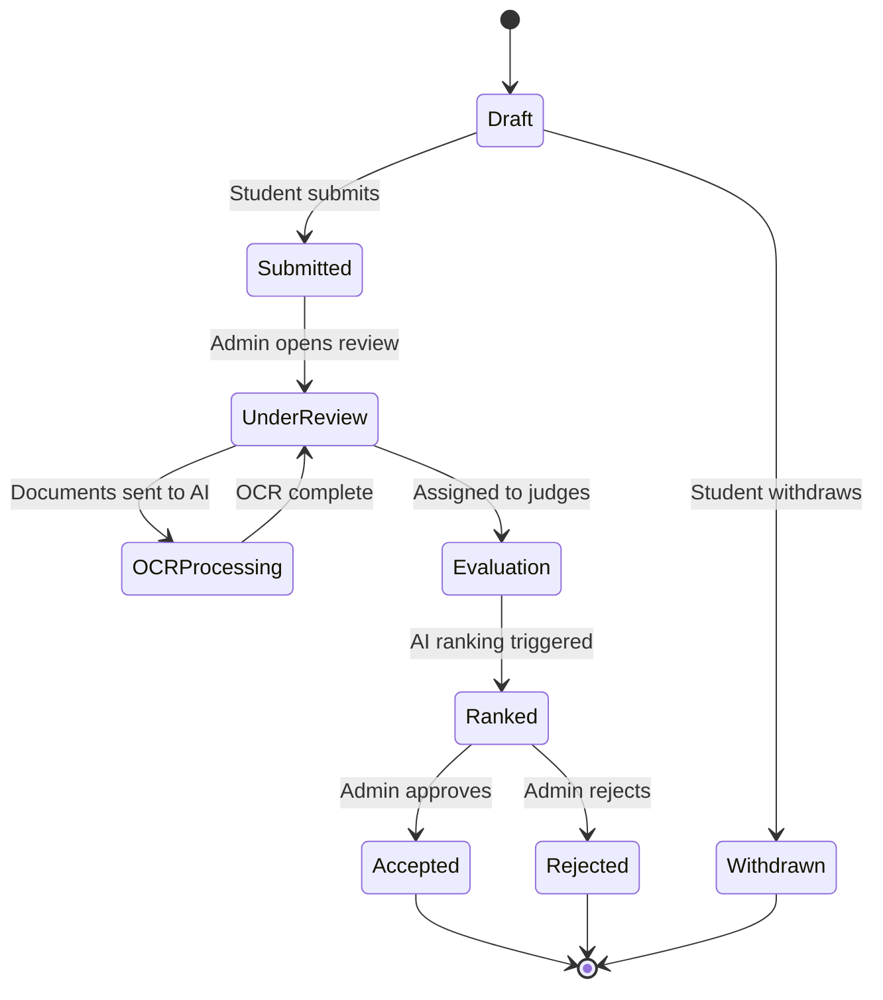

### Data Entities
- `scholarship_cycles`, `scholarship_criteria`, `scholarship_applications`, `application_documents`, `application_academic_info`, `evaluations`, `evaluation_scores`, `ranking_results`

---

## Module 4: Student Housing

### Purpose
Manage the full lifecycle of student residential housing — from application through occupancy to checkout.

### Key Components
- **Property Manager**: Define buildings, floors, rooms (type, capacity, amenities, rent amount)
- **Application Engine**: Student applies with required docs; eligibility checks
- **Allocation Engine**: Manual or AI-ranked allocation; room assignment
- **Occupancy Manager**: Check-in, check-out, room transfers, lease periods
- **Payment Tracker**: Monthly rent tracking, payment recording, overdue alerts
- **Maintenance System**: Residents submit maintenance requests; admin tracks resolution
- **Violation Manager**: Record violations, issue warnings, escalation workflow

### Data Entities
- `buildings`, `floors`, `rooms`, `housing_applications`, `room_allocations`, `rent_payments`, `maintenance_requests`, `housing_violations`

---

## Module 5: Innovation & Conference

### Purpose
Manage innovation competitions and academic conferences — project submissions, team formation, judging, and awards.

### Key Components
- **Event Manager**: Create competition events with categories, rules, deadlines, prizes
- **Submission Engine**: Submit projects (title, abstract, description, media, team members)
- **Team Manager**: Form teams, invite members, role assignment within team
- **Judging System**: Assign judges per category; multi-criteria rubric; score entry
- **Leaderboard**: Real-time scoring aggregation; public leaderboard
- **Certificate Generator**: Auto-generate certificates for participants and winners (PDF)

### Data Entities
- `innovation_events`, `event_categories`, `project_submissions`, `project_team_members`, `judging_assignments`, `judging_scores`, `certificates`

---

## Module 6: Judges Portal

### Purpose
Dedicated interface for evaluation judges across modules (scholarships, innovation competitions).

### Key Components
- **Assignment Dashboard**: View all assigned applications/projects pending evaluation
- **Evaluation Form**: Dynamic rubric rendered based on criteria definitions; score entry with notes
- **Conflict of Interest**: Judge declares COI; auto-reassignment
- **Progress Tracker**: Completion percentage; deadline reminders
- **Historical View**: Past evaluations and scores

### Data Entities
- Shared with Scholarship and Innovation modules: `evaluations`, `judging_assignments`, `judging_scores`
- `judge_profiles`, `conflict_of_interest_declarations`

---

## Module 7: Donor Portal

### Purpose
Public-facing and authenticated portal for donors — campaign discovery, donation processing, impact tracking.

### Key Components
- **Campaign Manager** (Admin): Create campaigns with goal amount, description, media, deadline
- **Campaign Browser** (Public): Browse active campaigns; progress bars; featured campaigns
- **Donation Processor**: Secure donation form; payment gateway integration; receipt generation
- **Donor Dashboard**: Donation history, total impact, tax receipts, subscription management
- **Impact Reports**: Admin publishes impact reports linked to campaigns; visible to donors
- **Recurring Donations**: Set up monthly/quarterly recurring donations

### Data Entities
- `campaigns`, `donations`, `donor_profiles`, `donation_receipts`, `impact_reports`, `recurring_donation_schedules`

---

## Module 8: Financial Auditing

### Purpose
Internal financial oversight — transaction recording, budget management, expense approval, audit-ready reporting.

### Key Components
- **Transaction Ledger**: Record all income (donations, rent) and expenses; double-entry style
- **Budget Manager**: Define annual budgets per program/department; track utilization
- **Expense Approval Workflow**: Submit expense → manager approval → finance approval → disbursement
- **Audit Dashboard**: Auditor view with filterable transaction logs, anomaly flags
- **Report Generator**: Monthly, quarterly, annual financial statements; exportable

### Workflow

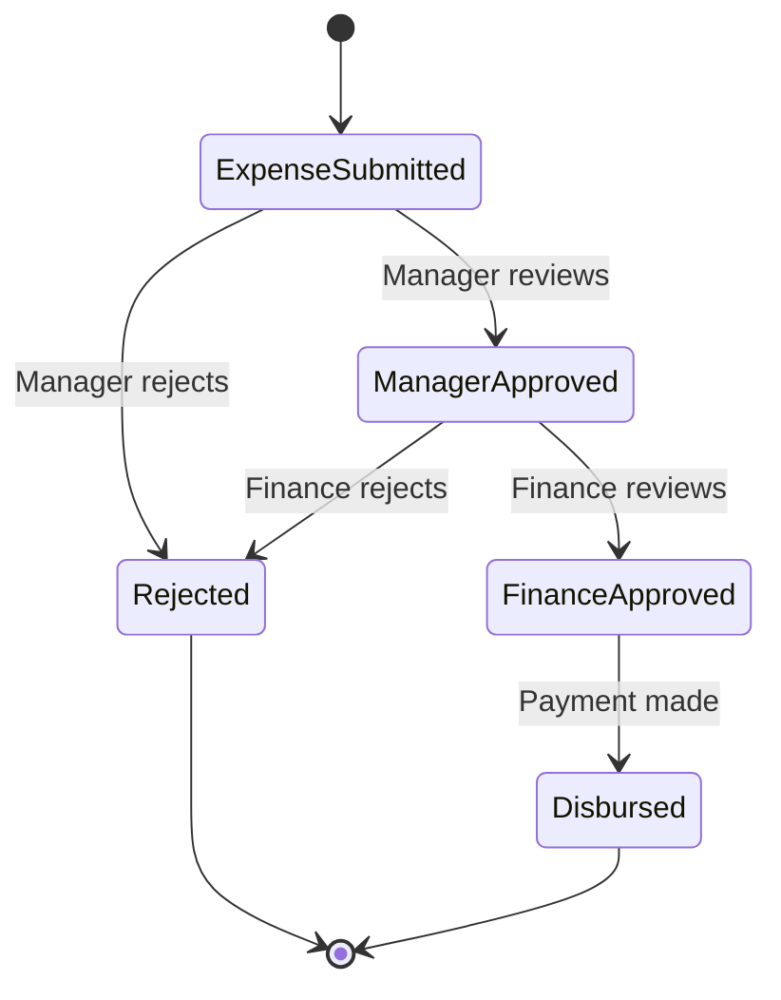

### Data Entities
- `financial_transactions`, `budgets`, `budget_allocations`, `expense_requests`, `expense_approvals`, `audit_logs`

---

## Module 9: Research Management

### Purpose
Support researchers with grant management, milestone tracking, and publication tracking.

### Key Components
- **Grant Proposal System**: Submit proposals with budget, timeline, objectives
- **Review Workflow**: Committee reviews proposals; approve/reject with feedback
- **Milestone Tracker**: Define milestones per grant; researcher reports progress
- **Publication Tracker**: Link publications and outputs to grants
- **Budget Utilization**: Track spending against approved grant budget

### Data Entities
- `research_grants`, `grant_proposals`, `grant_milestones`, `grant_publications`, `grant_budget_items`

---

## Module 10: Inventory Management

### Purpose
Track organizational assets and supplies across facilities.

### Key Components
- **Asset Registry**: Register assets with category, purchase date, value, location, condition
- **Assignment Tracker**: Assign assets to rooms, departments, or individuals
- **Maintenance Log**: Record maintenance events, costs, next scheduled maintenance
- **Depreciation Calculator**: Straight-line depreciation tracking
- **Low Stock Alerts**: Configurable thresholds for consumable supplies

### Data Entities
- `assets`, `asset_categories`, `asset_assignments`, `asset_maintenance_logs`, `consumable_supplies`, `supply_stock_levels`

---

## Module 11: OCR Processing (AI)

### Purpose
Extract structured data from scanned documents uploaded by students.

### Key Components
- **Task Queue Consumer**: Listens to Redis queue for OCR jobs
- **Pre-processor**: Image enhancement (deskew, denoise, contrast)
- **OCR Engine**: Tesseract / PaddleOCR with Arabic + English language support
- **Field Extractor**: Regex + NLP-based extraction of key fields (name, GPA, university, dates)
- **Confidence Scorer**: Assigns confidence score; flags low-confidence results for manual review
- **Result Writer**: Saves structured JSON to PostgreSQL via Go API callback

### Processing Pipeline

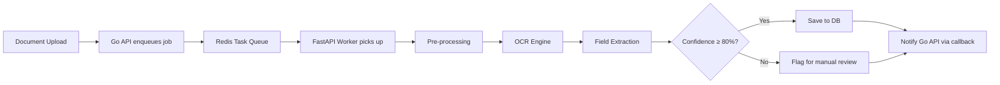

### Data Entities
- `ocr_tasks`, `ocr_results`, `ocr_manual_reviews`

---

## Module 12: Candidate Ranking (AI)

### Purpose
Score and rank applicants for scholarships and housing using configurable weighted criteria.

### Key Components
- **Criteria Loader**: Fetch criteria definitions and weights from Go API
- **Data Normalizer**: Normalize applicant data to comparable scales (0–1)
- **Scoring Engine**: Weighted sum of normalized criteria scores
- **Rank Generator**: Sort by score; handle ties; generate rank list
- **Anomaly Detector**: Flag unusual patterns (e.g., identical scores, outlier data)
- **Explanation Generator**: Per-applicant score breakdown for transparency

### Data Entities
- `ranking_tasks`, `ranking_results`, `ranking_criteria_scores`

---

## Module 13: Notifications

### Purpose
Cross-module notification delivery — in-app and email.

### Key Components
- **Event Bus**: Modules emit domain events (e.g., `application.submitted`, `evaluation.completed`)
- **Notification Router**: Maps events to notification templates and delivery channels
- **In-App Delivery**: WebSocket or SSE for real-time; fallback polling
- **Email Delivery**: SMTP integration (SendGrid / Mailgun); template-based
- **Preference Manager**: Users configure which notifications they receive and via which channel
- **Batch Sender**: Admin broadcasts announcements to filtered user groups

### Data Entities
- `notifications`, `notification_preferences`, `notification_templates`, `email_logs`

---

## Module 14: Reporting & Analytics

### Purpose
Cross-module dashboards, KPIs, and exportable reports.

### Key Components
- **Dashboard Engine**: Role-specific dashboards with configurable widgets
- **KPI Calculator**: Pre-computed metrics refreshed periodically (materialized views or Redis cache)
- **Report Builder**: Filterable, date-ranged reports per module
- **Export Engine**: PDF and Excel export via server-side generation
- **Trend Analysis**: Year-over-year comparisons, growth metrics

### Key Metrics by Module

| Module | Key Metrics |
|---|---|
| Scholarships | Applications per cycle, acceptance rate, avg GPA, gender distribution |
| Housing | Occupancy rate, rent collection rate, maintenance resolution time |
| Innovation | Submissions per event, avg score, participation growth |
| Donations | Total raised, campaign completion rate, donor retention rate |
| Finance | Budget utilization, expense approval time, surplus/deficit |

### Data Entities
- `report_definitions`, `report_snapshots`, `dashboard_widgets`, `kpi_cache`

---

## Module 15: File & Document Management

### Purpose
Centralized file storage, access control, and lifecycle management.

### Key Components
- **Upload Service**: Chunked upload for large files; progress tracking
- **Storage Backend**: Local filesystem (dev) / S3-compatible object storage (production)
- **Access Control**: File-level permissions tied to parent entity (e.g., application documents only visible to applicant + assigned admin/judge)
- **Virus Scan**: ClamAV integration for uploaded files
- **Lifecycle**: Retention policies; auto-archive after configurable period

### Data Entities
- `files`, `file_access_logs`

---

## Module 16: Audit & Logging

### Purpose
Immutable audit trail for all mutations; system-wide logging.

### Key Components
- **Mutation Logger**: Middleware captures every CREATE/UPDATE/DELETE with before/after snapshots
- **User Activity Log**: Login, logout, page views, significant actions
- **Admin Audit View**: Searchable, filterable audit log for super admins
- **Log Aggregation**: Structured logging (JSON) to stdout → collected by Docker → forwarded to log aggregator

### Data Entities
- `audit_logs`, `user_activity_logs`

---

# Phase 3 — Database Design

## 3.1 Entity-Relationship Diagram (High-Level)

```mermaid
erDiagram
    USERS ||--o{ USER_ROLES : has
    ROLES ||--o{ USER_ROLES : assigned_to
    ROLES ||--o{ ROLE_PERMISSIONS : has
    PERMISSIONS ||--o{ ROLE_PERMISSIONS : assigned_to

    USERS ||--o| USER_PROFILES : has
    USERS ||--o{ REFRESH_TOKENS : has
    USERS ||--o{ NOTIFICATIONS : receives

    USERS ||--o{ SCHOLARSHIP_APPLICATIONS : submits
    SCHOLARSHIP_CYCLES ||--o{ SCHOLARSHIP_APPLICATIONS : contains
    SCHOLARSHIP_CYCLES ||--o{ SCHOLARSHIP_CRITERIA : defines
    SCHOLARSHIP_APPLICATIONS ||--o{ APPLICATION_DOCUMENTS : has
    SCHOLARSHIP_APPLICATIONS ||--o{ EVALUATIONS : evaluated_by
    EVALUATIONS ||--o{ EVALUATION_SCORES : has
    SCHOLARSHIP_APPLICATIONS ||--o{ RANKING_RESULTS : ranked_in

    USERS ||--o{ HOUSING_APPLICATIONS : submits
    BUILDINGS ||--o{ FLOORS : has
    FLOORS ||--o{ ROOMS : has
    ROOMS ||--o{ ROOM_ALLOCATIONS : allocated_to
    HOUSING_APPLICATIONS ||--o| ROOM_ALLOCATIONS : results_in
    ROOM_ALLOCATIONS ||--o{ RENT_PAYMENTS : generates
    ROOM_ALLOCATIONS ||--o{ MAINTENANCE_REQUESTS : has

    INNOVATION_EVENTS ||--o{ EVENT_CATEGORIES : has
    EVENT_CATEGORIES ||--o{ PROJECT_SUBMISSIONS : receives
    USERS ||--o{ PROJECT_SUBMISSIONS : submits
    PROJECT_SUBMISSIONS ||--o{ PROJECT_TEAM_MEMBERS : has
    PROJECT_SUBMISSIONS ||--o{ JUDGING_ASSIGNMENTS : assigned_to
    JUDGING_ASSIGNMENTS ||--o{ JUDGING_SCORES : produces

    CAMPAIGNS ||--o{ DONATIONS : receives
    USERS ||--o{ DONATIONS : makes
    DONATIONS ||--o| DONATION_RECEIPTS : generates

    FINANCIAL_TRANSACTIONS ||--o| EXPENSE_REQUESTS : originates_from
    BUDGETS ||--o{ BUDGET_ALLOCATIONS : has

    USERS ||--o{ RESEARCH_GRANTS : owns
    RESEARCH_GRANTS ||--o{ GRANT_MILESTONES : has
    RESEARCH_GRANTS ||--o{ GRANT_PUBLICATIONS : produces

    ASSETS ||--o{ ASSET_ASSIGNMENTS : assigned_via
    ASSETS ||--o{ ASSET_MAINTENANCE_LOGS : tracked_by
```

---

## 3.2 Table Specifications

### 3.2.1 Core / Auth Tables

#### `users`
| Column | Type | Constraints | Description |
|---|---|---|---|
| `id` | UUID | PK, DEFAULT gen_random_uuid() | Primary identifier |
| `email` | VARCHAR(255) | UNIQUE, NOT NULL | Login email |
| `password_hash` | VARCHAR(255) | NOT NULL | bcrypt hash |
| `email_verified` | BOOLEAN | DEFAULT false | Email verification status |
| `is_active` | BOOLEAN | DEFAULT true | Soft-active flag |
| `last_login_at` | TIMESTAMPTZ | NULL | Last successful login |
| `created_at` | TIMESTAMPTZ | DEFAULT NOW() | Record creation |
| `updated_at` | TIMESTAMPTZ | DEFAULT NOW() | Last modification |
| `deleted_at` | TIMESTAMPTZ | NULL | Soft delete marker |

#### `roles`
| Column | Type | Constraints |
|---|---|---|
| `id` | UUID | PK |
| `name` | VARCHAR(50) | UNIQUE, NOT NULL |
| `display_name_en` | VARCHAR(100) | NOT NULL |
| `display_name_ar` | VARCHAR(100) | NOT NULL |
| `description` | TEXT | NULL |
| `is_system` | BOOLEAN | DEFAULT false |
| `created_at` | TIMESTAMPTZ | DEFAULT NOW() |

#### `permissions`
| Column | Type | Constraints |
|---|---|---|
| `id` | UUID | PK |
| `resource` | VARCHAR(100) | NOT NULL |
| `action` | VARCHAR(50) | NOT NULL |
| `description` | TEXT | NULL |
| **Unique** | | `(resource, action)` |

#### `user_roles`
| Column | Type | Constraints |
|---|---|---|
| `user_id` | UUID | FK → users.id |
| `role_id` | UUID | FK → roles.id |
| `assigned_by` | UUID | FK → users.id |
| `assigned_at` | TIMESTAMPTZ | DEFAULT NOW() |
| **PK** | | `(user_id, role_id)` |

#### `role_permissions`
| Column | Type | Constraints |
|---|---|---|
| `role_id` | UUID | FK → roles.id |
| `permission_id` | UUID | FK → permissions.id |
| **PK** | | `(role_id, permission_id)` |

#### `user_profiles`
| Column | Type | Constraints |
|---|---|---|
| `user_id` | UUID | PK, FK → users.id |
| `first_name_en` | VARCHAR(100) | NOT NULL |
| `first_name_ar` | VARCHAR(100) | NULL |
| `last_name_en` | VARCHAR(100) | NOT NULL |
| `last_name_ar` | VARCHAR(100) | NULL |
| `phone` | VARCHAR(20) | NULL |
| `date_of_birth` | DATE | NULL |
| `gender` | VARCHAR(10) | CHECK IN ('male','female') |
| `nationality` | VARCHAR(100) | NULL |
| `national_id` | VARCHAR(50) | NULL |
| `university` | VARCHAR(200) | NULL |
| `major` | VARCHAR(200) | NULL |
| `gpa` | DECIMAL(4,2) | NULL, CHECK (0 ≤ gpa ≤ 4.0) |
| `academic_year` | SMALLINT | NULL |
| `avatar_file_id` | UUID | FK → files.id |
| `address` | TEXT | NULL |
| `bio` | TEXT | NULL |
| `created_at` | TIMESTAMPTZ | DEFAULT NOW() |
| `updated_at` | TIMESTAMPTZ | DEFAULT NOW() |

#### `refresh_tokens`
| Column | Type | Constraints |
|---|---|---|
| `id` | UUID | PK |
| `user_id` | UUID | FK → users.id |
| `token_hash` | VARCHAR(255) | UNIQUE, NOT NULL |
| `expires_at` | TIMESTAMPTZ | NOT NULL |
| `revoked` | BOOLEAN | DEFAULT false |
| `created_at` | TIMESTAMPTZ | DEFAULT NOW() |
| `user_agent` | TEXT | NULL |
| `ip_address` | INET | NULL |

#### `login_attempts`
| Column | Type | Constraints |
|---|---|---|
| `id` | UUID | PK |
| `email` | VARCHAR(255) | NOT NULL |
| `ip_address` | INET | NOT NULL |
| `success` | BOOLEAN | NOT NULL |
| `attempted_at` | TIMESTAMPTZ | DEFAULT NOW() |
| `user_agent` | TEXT | NULL |

---

### 3.2.2 Scholarship Tables

#### `scholarship_cycles`
| Column | Type | Constraints |
|---|---|---|
| `id` | UUID | PK |
| `name_en` | VARCHAR(200) | NOT NULL |
| `name_ar` | VARCHAR(200) | NOT NULL |
| `description` | TEXT | NULL |
| `academic_year` | VARCHAR(9) | NOT NULL (e.g., "2025-2026") |
| `application_start` | TIMESTAMPTZ | NOT NULL |
| `application_deadline` | TIMESTAMPTZ | NOT NULL |
| `evaluation_deadline` | TIMESTAMPTZ | NULL |
| `total_quota` | INTEGER | NOT NULL |
| `status` | VARCHAR(20) | CHECK IN ('draft','open','closed','evaluating','completed') |
| `created_by` | UUID | FK → users.id |
| `created_at` | TIMESTAMPTZ | DEFAULT NOW() |
| `updated_at` | TIMESTAMPTZ | DEFAULT NOW() |
| `deleted_at` | TIMESTAMPTZ | NULL |

#### `scholarship_criteria`
| Column | Type | Constraints |
|---|---|---|
| `id` | UUID | PK |
| `cycle_id` | UUID | FK → scholarship_cycles.id |
| `name_en` | VARCHAR(200) | NOT NULL |
| `name_ar` | VARCHAR(200) | NOT NULL |
| `description` | TEXT | NULL |
| `weight` | DECIMAL(5,2) | NOT NULL, CHECK (weight > 0) |
| `max_score` | DECIMAL(5,2) | NOT NULL |
| `data_source` | VARCHAR(50) | CHECK IN ('manual','ocr','computed') |
| `sort_order` | SMALLINT | NOT NULL |

#### `scholarship_applications`
| Column | Type | Constraints |
|---|---|---|
| `id` | UUID | PK |
| `cycle_id` | UUID | FK → scholarship_cycles.id |
| `applicant_id` | UUID | FK → users.id |
| `status` | VARCHAR(20) | CHECK IN ('draft','submitted','under_review','evaluation','ranked','accepted','rejected','withdrawn') |
| `submitted_at` | TIMESTAMPTZ | NULL |
| `gpa_verified` | DECIMAL(4,2) | NULL |
| `family_income` | DECIMAL(12,2) | NULL |
| `family_size` | SMALLINT | NULL |
| `distance_km` | DECIMAL(8,2) | NULL |
| `special_circumstances` | TEXT | NULL |
| `admin_notes` | TEXT | NULL |
| `final_score` | DECIMAL(8,4) | NULL |
| `final_rank` | INTEGER | NULL |
| `created_at` | TIMESTAMPTZ | DEFAULT NOW() |
| `updated_at` | TIMESTAMPTZ | DEFAULT NOW() |
| `deleted_at` | TIMESTAMPTZ | NULL |
| **Unique** | | `(cycle_id, applicant_id)` |

#### `application_documents`
| Column | Type | Constraints |
|---|---|---|
| `id` | UUID | PK |
| `application_id` | UUID | FK → scholarship_applications.id |
| `file_id` | UUID | FK → files.id |
| `document_type` | VARCHAR(50) | NOT NULL (transcript, id_card, income_proof, etc.) |
| `ocr_task_id` | UUID | FK → ocr_tasks.id, NULL |
| `uploaded_at` | TIMESTAMPTZ | DEFAULT NOW() |

#### `evaluations`
| Column | Type | Constraints |
|---|---|---|
| `id` | UUID | PK |
| `application_id` | UUID | FK → scholarship_applications.id |
| `judge_id` | UUID | FK → users.id |
| `status` | VARCHAR(20) | CHECK IN ('assigned','in_progress','completed') |
| `total_score` | DECIMAL(8,4) | NULL |
| `comments` | TEXT | NULL |
| `evaluated_at` | TIMESTAMPTZ | NULL |
| `assigned_at` | TIMESTAMPTZ | DEFAULT NOW() |
| **Unique** | | `(application_id, judge_id)` |

#### `evaluation_scores`
| Column | Type | Constraints |
|---|---|---|
| `id` | UUID | PK |
| `evaluation_id` | UUID | FK → evaluations.id |
| `criteria_id` | UUID | FK → scholarship_criteria.id |
| `score` | DECIMAL(5,2) | NOT NULL |
| `notes` | TEXT | NULL |

---

### 3.2.3 Housing Tables

#### `buildings`
| Column | Type | Constraints |
|---|---|---|
| `id` | UUID | PK |
| `name_en` | VARCHAR(200) | NOT NULL |
| `name_ar` | VARCHAR(200) | NOT NULL |
| `address` | TEXT | NULL |
| `total_capacity` | INTEGER | NOT NULL |
| `gender` | VARCHAR(10) | CHECK IN ('male','female','mixed') |
| `is_active` | BOOLEAN | DEFAULT true |
| `created_at` | TIMESTAMPTZ | DEFAULT NOW() |

#### `floors`
| Column | Type | Constraints |
|---|---|---|
| `id` | UUID | PK |
| `building_id` | UUID | FK → buildings.id |
| `floor_number` | SMALLINT | NOT NULL |
| `name` | VARCHAR(50) | NULL |
| **Unique** | | `(building_id, floor_number)` |

#### `rooms`
| Column | Type | Constraints |
|---|---|---|
| `id` | UUID | PK |
| `floor_id` | UUID | FK → floors.id |
| `room_number` | VARCHAR(20) | NOT NULL |
| `room_type` | VARCHAR(30) | CHECK IN ('single','double','triple','quad','suite') |
| `capacity` | SMALLINT | NOT NULL |
| `current_occupancy` | SMALLINT | DEFAULT 0 |
| `monthly_rent` | DECIMAL(10,2) | NOT NULL |
| `amenities` | JSONB | DEFAULT '[]' |
| `is_available` | BOOLEAN | DEFAULT true |
| `created_at` | TIMESTAMPTZ | DEFAULT NOW() |
| **Unique** | | `(floor_id, room_number)` |

#### `housing_applications`
| Column | Type | Constraints |
|---|---|---|
| `id` | UUID | PK |
| `applicant_id` | UUID | FK → users.id |
| `academic_year` | VARCHAR(9) | NOT NULL |
| `status` | VARCHAR(20) | CHECK IN ('draft','submitted','under_review','approved','rejected','allocated','withdrawn') |
| `preferred_room_type` | VARCHAR(30) | NULL |
| `special_needs` | TEXT | NULL |
| `submitted_at` | TIMESTAMPTZ | NULL |
| `created_at` | TIMESTAMPTZ | DEFAULT NOW() |
| `updated_at` | TIMESTAMPTZ | DEFAULT NOW() |
| `deleted_at` | TIMESTAMPTZ | NULL |

#### `room_allocations`
| Column | Type | Constraints |
|---|---|---|
| `id` | UUID | PK |
| `application_id` | UUID | FK → housing_applications.id |
| `room_id` | UUID | FK → rooms.id |
| `resident_id` | UUID | FK → users.id |
| `lease_start` | DATE | NOT NULL |
| `lease_end` | DATE | NOT NULL |
| `check_in_at` | TIMESTAMPTZ | NULL |
| `check_out_at` | TIMESTAMPTZ | NULL |
| `status` | VARCHAR(20) | CHECK IN ('active','checked_out','evicted','transferred') |
| `created_at` | TIMESTAMPTZ | DEFAULT NOW() |

#### `rent_payments`
| Column | Type | Constraints |
|---|---|---|
| `id` | UUID | PK |
| `allocation_id` | UUID | FK → room_allocations.id |
| `amount` | DECIMAL(10,2) | NOT NULL |
| `payment_month` | DATE | NOT NULL |
| `payment_date` | TIMESTAMPTZ | NULL |
| `status` | VARCHAR(20) | CHECK IN ('pending','paid','overdue','waived') |
| `payment_method` | VARCHAR(30) | NULL |
| `transaction_ref` | VARCHAR(100) | NULL |
| `created_at` | TIMESTAMPTZ | DEFAULT NOW() |

#### `maintenance_requests`
| Column | Type | Constraints |
|---|---|---|
| `id` | UUID | PK |
| `allocation_id` | UUID | FK → room_allocations.id |
| `category` | VARCHAR(50) | NOT NULL (plumbing, electrical, furniture, etc.) |
| `description` | TEXT | NOT NULL |
| `priority` | VARCHAR(10) | CHECK IN ('low','medium','high','urgent') |
| `status` | VARCHAR(20) | CHECK IN ('submitted','in_progress','resolved','closed') |
| `resolved_at` | TIMESTAMPTZ | NULL |
| `resolver_notes` | TEXT | NULL |
| `created_at` | TIMESTAMPTZ | DEFAULT NOW() |

#### `housing_violations`
| Column | Type | Constraints |
|---|---|---|
| `id` | UUID | PK |
| `allocation_id` | UUID | FK → room_allocations.id |
| `violation_type` | VARCHAR(100) | NOT NULL |
| `description` | TEXT | NOT NULL |
| `severity` | VARCHAR(10) | CHECK IN ('minor','major','critical') |
| `action_taken` | TEXT | NULL |
| `issued_by` | UUID | FK → users.id |
| `issued_at` | TIMESTAMPTZ | DEFAULT NOW() |

---

### 3.2.4 Innovation & Conference Tables

#### `innovation_events`
| Column | Type | Constraints |
|---|---|---|
| `id` | UUID | PK |
| `name_en` | VARCHAR(200) | NOT NULL |
| `name_ar` | VARCHAR(200) | NOT NULL |
| `description` | TEXT | NULL |
| `event_date` | DATE | NULL |
| `submission_deadline` | TIMESTAMPTZ | NOT NULL |
| `status` | VARCHAR(20) | CHECK IN ('draft','open','judging','completed') |
| `created_by` | UUID | FK → users.id |
| `created_at` | TIMESTAMPTZ | DEFAULT NOW() |
| `deleted_at` | TIMESTAMPTZ | NULL |

#### `event_categories`
| Column | Type | Constraints |
|---|---|---|
| `id` | UUID | PK |
| `event_id` | UUID | FK → innovation_events.id |
| `name_en` | VARCHAR(200) | NOT NULL |
| `name_ar` | VARCHAR(200) | NOT NULL |
| `description` | TEXT | NULL |
| `max_team_size` | SMALLINT | DEFAULT 5 |
| `sort_order` | SMALLINT | NOT NULL |

#### `project_submissions`
| Column | Type | Constraints |
|---|---|---|
| `id` | UUID | PK |
| `category_id` | UUID | FK → event_categories.id |
| `submitter_id` | UUID | FK → users.id |
| `title` | VARCHAR(300) | NOT NULL |
| `abstract` | TEXT | NOT NULL |
| `description` | TEXT | NULL |
| `status` | VARCHAR(20) | CHECK IN ('draft','submitted','under_judging','scored','winner') |
| `final_score` | DECIMAL(8,4) | NULL |
| `final_rank` | INTEGER | NULL |
| `submitted_at` | TIMESTAMPTZ | NULL |
| `created_at` | TIMESTAMPTZ | DEFAULT NOW() |
| `deleted_at` | TIMESTAMPTZ | NULL |

#### `project_team_members`
| Column | Type | Constraints |
|---|---|---|
| `project_id` | UUID | FK → project_submissions.id |
| `user_id` | UUID | FK → users.id |
| `role` | VARCHAR(50) | DEFAULT 'member' |
| `joined_at` | TIMESTAMPTZ | DEFAULT NOW() |
| **PK** | | `(project_id, user_id)` |

#### `judging_assignments`
| Column | Type | Constraints |
|---|---|---|
| `id` | UUID | PK |
| `project_id` | UUID | FK → project_submissions.id |
| `judge_id` | UUID | FK → users.id |
| `status` | VARCHAR(20) | CHECK IN ('assigned','in_progress','completed') |
| `assigned_at` | TIMESTAMPTZ | DEFAULT NOW() |
| **Unique** | | `(project_id, judge_id)` |

#### `judging_scores`
| Column | Type | Constraints |
|---|---|---|
| `id` | UUID | PK |
| `assignment_id` | UUID | FK → judging_assignments.id |
| `criteria_name` | VARCHAR(200) | NOT NULL |
| `score` | DECIMAL(5,2) | NOT NULL |
| `max_score` | DECIMAL(5,2) | NOT NULL |
| `notes` | TEXT | NULL |

---

### 3.2.5 Donor & Finance Tables

#### `campaigns`
| Column | Type | Constraints |
|---|---|---|
| `id` | UUID | PK |
| `title_en` | VARCHAR(300) | NOT NULL |
| `title_ar` | VARCHAR(300) | NOT NULL |
| `description` | TEXT | NULL |
| `goal_amount` | DECIMAL(14,2) | NOT NULL |
| `raised_amount` | DECIMAL(14,2) | DEFAULT 0 |
| `currency` | VARCHAR(3) | DEFAULT 'USD' |
| `start_date` | DATE | NOT NULL |
| `end_date` | DATE | NULL |
| `status` | VARCHAR(20) | CHECK IN ('draft','active','paused','completed','cancelled') |
| `cover_image_file_id` | UUID | FK → files.id |
| `created_by` | UUID | FK → users.id |
| `created_at` | TIMESTAMPTZ | DEFAULT NOW() |
| `deleted_at` | TIMESTAMPTZ | NULL |

#### `donations`
| Column | Type | Constraints |
|---|---|---|
| `id` | UUID | PK |
| `campaign_id` | UUID | FK → campaigns.id |
| `donor_id` | UUID | FK → users.id, NULL (anonymous) |
| `amount` | DECIMAL(14,2) | NOT NULL |
| `currency` | VARCHAR(3) | DEFAULT 'USD' |
| `payment_method` | VARCHAR(30) | NOT NULL |
| `payment_ref` | VARCHAR(200) | NULL |
| `is_anonymous` | BOOLEAN | DEFAULT false |
| `is_recurring` | BOOLEAN | DEFAULT false |
| `recurring_schedule_id` | UUID | FK → recurring_donation_schedules.id, NULL |
| `status` | VARCHAR(20) | CHECK IN ('pending','completed','failed','refunded') |
| `donated_at` | TIMESTAMPTZ | DEFAULT NOW() |

#### `donor_profiles`
| Column | Type | Constraints |
|---|---|---|
| `user_id` | UUID | PK, FK → users.id |
| `organization_name` | VARCHAR(300) | NULL |
| `country` | VARCHAR(100) | NULL |
| `total_donated` | DECIMAL(14,2) | DEFAULT 0 |
| `first_donation_at` | TIMESTAMPTZ | NULL |
| `donor_tier` | VARCHAR(20) | CHECK IN ('bronze','silver','gold','platinum') |

#### `financial_transactions`
| Column | Type | Constraints |
|---|---|---|
| `id` | UUID | PK |
| `type` | VARCHAR(20) | CHECK IN ('income','expense','transfer') |
| `category` | VARCHAR(100) | NOT NULL |
| `amount` | DECIMAL(14,2) | NOT NULL |
| `currency` | VARCHAR(3) | DEFAULT 'USD' |
| `description` | TEXT | NULL |
| `reference_type` | VARCHAR(50) | NULL (donation, rent_payment, expense_request, etc.) |
| `reference_id` | UUID | NULL |
| `budget_id` | UUID | FK → budgets.id, NULL |
| `recorded_by` | UUID | FK → users.id |
| `transaction_date` | DATE | NOT NULL |
| `created_at` | TIMESTAMPTZ | DEFAULT NOW() |

#### `budgets`
| Column | Type | Constraints |
|---|---|---|
| `id` | UUID | PK |
| `name_en` | VARCHAR(200) | NOT NULL |
| `name_ar` | VARCHAR(200) | NOT NULL |
| `fiscal_year` | VARCHAR(9) | NOT NULL |
| `total_amount` | DECIMAL(14,2) | NOT NULL |
| `spent_amount` | DECIMAL(14,2) | DEFAULT 0 |
| `created_at` | TIMESTAMPTZ | DEFAULT NOW() |

#### `budget_allocations`
| Column | Type | Constraints |
|---|---|---|
| `id` | UUID | PK |
| `budget_id` | UUID | FK → budgets.id |
| `program` | VARCHAR(100) | NOT NULL (scholarships, housing, innovation, etc.) |
| `allocated_amount` | DECIMAL(14,2) | NOT NULL |
| `spent_amount` | DECIMAL(14,2) | DEFAULT 0 |

#### `expense_requests`
| Column | Type | Constraints |
|---|---|---|
| `id` | UUID | PK |
| `requester_id` | UUID | FK → users.id |
| `budget_allocation_id` | UUID | FK → budget_allocations.id |
| `amount` | DECIMAL(14,2) | NOT NULL |
| `description` | TEXT | NOT NULL |
| `status` | VARCHAR(20) | CHECK IN ('submitted','manager_approved','finance_approved','disbursed','rejected') |
| `created_at` | TIMESTAMPTZ | DEFAULT NOW() |
| `updated_at` | TIMESTAMPTZ | DEFAULT NOW() |

---

### 3.2.6 Research Tables

#### `research_grants`
| Column | Type | Constraints |
|---|---|---|
| `id` | UUID | PK |
| `researcher_id` | UUID | FK → users.id |
| `title` | VARCHAR(300) | NOT NULL |
| `abstract` | TEXT | NOT NULL |
| `requested_budget` | DECIMAL(14,2) | NOT NULL |
| `approved_budget` | DECIMAL(14,2) | NULL |
| `status` | VARCHAR(20) | CHECK IN ('proposed','under_review','approved','active','completed','cancelled') |
| `start_date` | DATE | NULL |
| `end_date` | DATE | NULL |
| `created_at` | TIMESTAMPTZ | DEFAULT NOW() |
| `deleted_at` | TIMESTAMPTZ | NULL |

#### `grant_milestones`
| Column | Type | Constraints |
|---|---|---|
| `id` | UUID | PK |
| `grant_id` | UUID | FK → research_grants.id |
| `title` | VARCHAR(200) | NOT NULL |
| `description` | TEXT | NULL |
| `due_date` | DATE | NOT NULL |
| `status` | VARCHAR(20) | CHECK IN ('pending','in_progress','completed','overdue') |
| `completed_at` | TIMESTAMPTZ | NULL |

#### `grant_publications`
| Column | Type | Constraints |
|---|---|---|
| `id` | UUID | PK |
| `grant_id` | UUID | FK → research_grants.id |
| `title` | VARCHAR(500) | NOT NULL |
| `journal` | VARCHAR(300) | NULL |
| `doi` | VARCHAR(100) | NULL |
| `published_at` | DATE | NULL |
| `file_id` | UUID | FK → files.id |

---

### 3.2.7 Inventory Tables

#### `asset_categories`
| Column | Type | Constraints |
|---|---|---|
| `id` | UUID | PK |
| `name_en` | VARCHAR(200) | NOT NULL |
| `name_ar` | VARCHAR(200) | NOT NULL |
| `parent_id` | UUID | FK → asset_categories.id (self-ref, tree) |

#### `assets`
| Column | Type | Constraints |
|---|---|---|
| `id` | UUID | PK |
| `category_id` | UUID | FK → asset_categories.id |
| `asset_tag` | VARCHAR(50) | UNIQUE, NOT NULL |
| `name` | VARCHAR(200) | NOT NULL |
| `description` | TEXT | NULL |
| `purchase_date` | DATE | NULL |
| `purchase_cost` | DECIMAL(12,2) | NULL |
| `current_value` | DECIMAL(12,2) | NULL |
| `condition` | VARCHAR(20) | CHECK IN ('new','good','fair','poor','decommissioned') |
| `location` | VARCHAR(200) | NULL |
| `room_id` | UUID | FK → rooms.id, NULL |
| `created_at` | TIMESTAMPTZ | DEFAULT NOW() |
| `deleted_at` | TIMESTAMPTZ | NULL |

#### `asset_assignments`
| Column | Type | Constraints |
|---|---|---|
| `id` | UUID | PK |
| `asset_id` | UUID | FK → assets.id |
| `assigned_to_user_id` | UUID | FK → users.id, NULL |
| `assigned_to_department` | VARCHAR(100) | NULL |
| `assigned_at` | TIMESTAMPTZ | DEFAULT NOW() |
| `returned_at` | TIMESTAMPTZ | NULL |

#### `asset_maintenance_logs`
| Column | Type | Constraints |
|---|---|---|
| `id` | UUID | PK |
| `asset_id` | UUID | FK → assets.id |
| `maintenance_type` | VARCHAR(50) | NOT NULL |
| `description` | TEXT | NULL |
| `cost` | DECIMAL(10,2) | NULL |
| `performed_at` | DATE | NOT NULL |
| `next_maintenance` | DATE | NULL |

---

### 3.2.8 AI / OCR Tables

#### `ocr_tasks`
| Column | Type | Constraints |
|---|---|---|
| `id` | UUID | PK |
| `document_id` | UUID | FK → application_documents.id |
| `status` | VARCHAR(20) | CHECK IN ('queued','processing','completed','failed','manual_review') |
| `queued_at` | TIMESTAMPTZ | DEFAULT NOW() |
| `started_at` | TIMESTAMPTZ | NULL |
| `completed_at` | TIMESTAMPTZ | NULL |
| `error_message` | TEXT | NULL |
| `retry_count` | SMALLINT | DEFAULT 0 |

#### `ocr_results`
| Column | Type | Constraints |
|---|---|---|
| `id` | UUID | PK |
| `task_id` | UUID | FK → ocr_tasks.id |
| `raw_text` | TEXT | NULL |
| `extracted_data` | JSONB | NOT NULL |
| `confidence_score` | DECIMAL(5,4) | NOT NULL |
| `needs_review` | BOOLEAN | DEFAULT false |
| `reviewed_by` | UUID | FK → users.id, NULL |
| `reviewed_at` | TIMESTAMPTZ | NULL |
| `created_at` | TIMESTAMPTZ | DEFAULT NOW() |

#### `ranking_results`
| Column | Type | Constraints |
|---|---|---|
| `id` | UUID | PK |
| `application_id` | UUID | FK → scholarship_applications.id |
| `cycle_id` | UUID | FK → scholarship_cycles.id |
| `total_score` | DECIMAL(8,4) | NOT NULL |
| `rank` | INTEGER | NOT NULL |
| `criteria_breakdown` | JSONB | NOT NULL |
| `ranked_at` | TIMESTAMPTZ | DEFAULT NOW() |

---

### 3.2.9 System Tables

#### `files`
| Column | Type | Constraints |
|---|---|---|
| `id` | UUID | PK |
| `original_name` | VARCHAR(500) | NOT NULL |
| `stored_name` | VARCHAR(500) | NOT NULL |
| `mime_type` | VARCHAR(100) | NOT NULL |
| `size_bytes` | BIGINT | NOT NULL |
| `storage_path` | VARCHAR(1000) | NOT NULL |
| `storage_backend` | VARCHAR(20) | DEFAULT 'local' |
| `uploaded_by` | UUID | FK → users.id |
| `uploaded_at` | TIMESTAMPTZ | DEFAULT NOW() |
| `deleted_at` | TIMESTAMPTZ | NULL |

#### `notifications`
| Column | Type | Constraints |
|---|---|---|
| `id` | UUID | PK |
| `user_id` | UUID | FK → users.id |
| `type` | VARCHAR(50) | NOT NULL |
| `title` | VARCHAR(300) | NOT NULL |
| `body` | TEXT | NOT NULL |
| `data` | JSONB | NULL |
| `is_read` | BOOLEAN | DEFAULT false |
| `read_at` | TIMESTAMPTZ | NULL |
| `created_at` | TIMESTAMPTZ | DEFAULT NOW() |

#### `notification_preferences`
| Column | Type | Constraints |
|---|---|---|
| `user_id` | UUID | FK → users.id |
| `notification_type` | VARCHAR(50) | NOT NULL |
| `channel` | VARCHAR(20) | CHECK IN ('in_app','email','both','none') |
| **PK** | | `(user_id, notification_type)` |

#### `audit_logs`
| Column | Type | Constraints |
|---|---|---|
| `id` | UUID | PK |
| `user_id` | UUID | FK → users.id, NULL (system actions) |
| `action` | VARCHAR(50) | NOT NULL (CREATE, UPDATE, DELETE) |
| `entity_type` | VARCHAR(100) | NOT NULL |
| `entity_id` | UUID | NOT NULL |
| `old_values` | JSONB | NULL |
| `new_values` | JSONB | NULL |
| `ip_address` | INET | NULL |
| `user_agent` | TEXT | NULL |
| `created_at` | TIMESTAMPTZ | DEFAULT NOW() |

> [!NOTE]
> `audit_logs` is **append-only** — no updates or deletes are ever performed on this table.

---

## 3.3 Index Strategy

| Table | Index | Type | Rationale |
|---|---|---|---|
| `users` | `idx_users_email` | UNIQUE B-tree | Login lookups |
| `users` | `idx_users_deleted_at` | B-tree (partial WHERE deleted_at IS NULL) | Soft-delete filtering |
| `scholarship_applications` | `idx_sch_app_cycle_status` | B-tree (cycle_id, status) | Filtered listing by cycle |
| `scholarship_applications` | `idx_sch_app_applicant` | B-tree (applicant_id) | "My applications" query |
| `evaluations` | `idx_eval_judge_status` | B-tree (judge_id, status) | Judge dashboard |
| `room_allocations` | `idx_alloc_room_status` | B-tree (room_id, status) | Occupancy queries |
| `room_allocations` | `idx_alloc_resident` | B-tree (resident_id) | Resident lookup |
| `donations` | `idx_donations_campaign` | B-tree (campaign_id) | Campaign total queries |
| `donations` | `idx_donations_donor` | B-tree (donor_id) | Donor history |
| `financial_transactions` | `idx_fin_tx_date` | B-tree (transaction_date) | Date-range reports |
| `financial_transactions` | `idx_fin_tx_budget` | B-tree (budget_id) | Budget utilization |
| `notifications` | `idx_notif_user_unread` | B-tree (user_id) WHERE is_read = false | Unread count badge |
| `audit_logs` | `idx_audit_entity` | B-tree (entity_type, entity_id) | Entity history lookup |
| `audit_logs` | `idx_audit_user` | B-tree (user_id) | User activity audit |
| `audit_logs` | `idx_audit_created` | B-tree (created_at) | Time-range queries |
| `ocr_tasks` | `idx_ocr_status` | B-tree (status) | Queue processing |
| `project_submissions` | `idx_proj_category_status` | B-tree (category_id, status) | Category listings |

### GIN Indexes (JSONB)

| Table | Column | Rationale |
|---|---|---|
| `rooms` | `amenities` | Filter rooms by amenity |
| `ocr_results` | `extracted_data` | Search extracted fields |
| `audit_logs` | `old_values`, `new_values` | Audit data search |

---

## 3.4 Foreign Key Strategy

- All FKs use `ON DELETE RESTRICT` by default (prevent accidental cascading deletes)
- Junction tables (e.g., `user_roles`, `role_permissions`) use `ON DELETE CASCADE`
- File references use `ON DELETE SET NULL` (file deletion should not cascade)
- All FK columns are indexed for join performance

---

## 3.5 Soft Delete Strategy

- Tables with `deleted_at TIMESTAMPTZ NULL` column
- Application queries always filter `WHERE deleted_at IS NULL`
- Partial indexes on `deleted_at IS NULL` for performance
- Cron job archives records where `deleted_at < NOW() - INTERVAL '2 years'` to archive tables
- Applied to: `users`, `scholarship_cycles`, `scholarship_applications`, `innovation_events`, `project_submissions`, `campaigns`, `research_grants`, `assets`, `files`

---

## 3.6 Multi-Year Historical Data Strategy

| Strategy | Detail |
|---|---|
| **Table Partitioning** | `audit_logs` and `financial_transactions` partitioned by year using PostgreSQL declarative partitioning (`PARTITION BY RANGE (created_at)`) |
| **Archive Tables** | Soft-deleted records older than 2 years moved to `*_archive` tables with same schema |
| **Data Retention** | Scholarship and financial data retained for 10+ years; older data in read-only archive partitions |
| **Materialized Views** | Pre-computed aggregations for analytics (e.g., `mv_scholarship_stats_by_year`, `mv_donation_totals_by_month`) |
| **Backup** | Daily incremental + weekly full pg_dump; stored in encrypted S3-compatible storage |

---

# Phase 4 — API Architecture

## 4.1 REST API Structure

Base URL: `/api/v1`

### Route Hierarchy

```
/api/v1
├── /auth
│   ├── POST   /register
│   ├── POST   /login
│   ├── POST   /refresh
│   ├── POST   /logout
│   ├── POST   /forgot-password
│   ├── POST   /reset-password
│   └── POST   /verify-email
│
├── /users
│   ├── GET    /me                          (own profile)
│   ├── PUT    /me                          (update own profile)
│   ├── PUT    /me/avatar                   (upload avatar)
│   ├── GET    /                            (admin: list users)
│   ├── POST   /                            (admin: create user)
│   ├── GET    /:id                         (admin: get user)
│   ├── PUT    /:id                         (admin: update user)
│   ├── DELETE /:id                         (admin: soft-delete user)
│   ├── PUT    /:id/roles                   (admin: assign roles)
│   └── POST   /bulk-import                 (admin: CSV import)
│
├── /scholarships
│   ├── /cycles
│   │   ├── GET    /                        (list cycles)
│   │   ├── POST   /                        (admin: create cycle)
│   │   ├── GET    /:id                     (get cycle details)
│   │   ├── PUT    /:id                     (admin: update cycle)
│   │   ├── DELETE /:id                     (admin: delete cycle)
│   │   ├── PUT    /:id/status              (admin: change status)
│   │   ├── GET    /:id/criteria            (get criteria)
│   │   ├── POST   /:id/criteria            (admin: add criteria)
│   │   ├── POST   /:id/trigger-ranking     (admin: trigger AI ranking)
│   │   └── GET    /:id/rankings            (admin: view rankings)
│   │
│   └── /applications
│       ├── GET    /                        (own applications)
│       ├── POST   /                        (submit application)
│       ├── GET    /:id                     (get application)
│       ├── PUT    /:id                     (update draft application)
│       ├── POST   /:id/submit              (finalize submission)
│       ├── POST   /:id/withdraw            (withdraw application)
│       ├── GET    /:id/documents            (list documents)
│       ├── POST   /:id/documents            (upload document)
│       ├── GET    /:id/evaluations          (admin/judge: view evals)
│       └── POST   /:id/evaluations          (judge: submit eval)
│
├── /housing
│   ├── /buildings
│   │   ├── GET    /                        (list buildings)
│   │   ├── POST   /                        (admin: create)
│   │   ├── GET    /:id                     (get building + rooms)
│   │   └── PUT    /:id                     (admin: update)
│   │
│   ├── /rooms
│   │   ├── GET    /                        (list rooms, filterable)
│   │   ├── GET    /:id                     (room details)
│   │   └── PUT    /:id                     (admin: update room)
│   │
│   ├── /applications
│   │   ├── GET    /                        (own or admin: list)
│   │   ├── POST   /                        (apply for housing)
│   │   ├── GET    /:id                     (get application)
│   │   └── PUT    /:id/status              (admin: approve/reject)
│   │
│   ├── /allocations
│   │   ├── POST   /                        (admin: allocate room)
│   │   ├── PUT    /:id/check-in            (admin: check in)
│   │   ├── PUT    /:id/check-out           (admin: check out)
│   │   └── GET    /:id/payments            (list rent payments)
│   │
│   └── /maintenance
│       ├── GET    /                        (list requests)
│       ├── POST   /                        (submit request)
│       ├── GET    /:id                     (get request)
│       └── PUT    /:id/status              (admin: update status)
│
├── /innovation
│   ├── /events
│   │   ├── GET    /                        (list events)
│   │   ├── POST   /                        (admin: create event)
│   │   ├── GET    /:id                     (event details)
│   │   ├── PUT    /:id                     (admin: update)
│   │   └── GET    /:id/leaderboard         (public leaderboard)
│   │
│   ├── /submissions
│   │   ├── GET    /                        (own or admin)
│   │   ├── POST   /                        (submit project)
│   │   ├── GET    /:id                     (project details)
│   │   ├── PUT    /:id                     (update draft)
│   │   └── POST   /:id/submit             (finalize)
│   │
│   └── /judging
│       ├── GET    /assignments             (judge: my assignments)
│       ├── GET    /assignments/:id         (assignment details)
│       └── POST   /assignments/:id/scores  (submit scores)
│
├── /donations
│   ├── /campaigns
│   │   ├── GET    /                        (public: list campaigns)
│   │   ├── POST   /                        (admin: create)
│   │   ├── GET    /:id                     (campaign details)
│   │   └── PUT    /:id                     (admin: update)
│   │
│   ├── POST   /                            (make donation)
│   ├── GET    /my-donations                (donor: history)
│   └── GET    /:id/receipt                 (download receipt PDF)
│
├── /finance
│   ├── /transactions
│   │   ├── GET    /                        (auditor: list)
│   │   ├── POST   /                        (admin: record)
│   │   └── GET    /:id                     (detail)
│   │
│   ├── /budgets
│   │   ├── GET    /                        (list budgets)
│   │   ├── POST   /                        (admin: create)
│   │   ├── GET    /:id                     (budget + allocations)
│   │   └── PUT    /:id                     (admin: update)
│   │
│   └── /expenses
│       ├── GET    /                        (list expense requests)
│       ├── POST   /                        (submit request)
│       ├── GET    /:id                     (detail)
│       └── PUT    /:id/approve             (manager/finance: approve)
│
├── /research
│   ├── /grants
│   │   ├── GET    /                        (list grants)
│   │   ├── POST   /                        (submit proposal)
│   │   ├── GET    /:id                     (grant detail)
│   │   ├── PUT    /:id                     (update)
│   │   ├── GET    /:id/milestones          (list milestones)
│   │   ├── POST   /:id/milestones          (add milestone)
│   │   └── GET    /:id/publications        (list pubs)
│   │
│   └── /publications
│       ├── POST   /                        (add publication)
│       └── GET    /:id                     (detail)
│
├── /inventory
│   ├── /assets
│   │   ├── GET    /                        (list assets)
│   │   ├── POST   /                        (register asset)
│   │   ├── GET    /:id                     (detail)
│   │   ├── PUT    /:id                     (update)
│   │   ├── POST   /:id/assign             (assign)
│   │   └── POST   /:id/maintenance        (log maintenance)
│   │
│   └── /categories
│       ├── GET    /                        (list categories)
│       └── POST   /                        (create category)
│
├── /notifications
│   ├── GET    /                            (my notifications)
│   ├── PUT    /:id/read                    (mark as read)
│   ├── PUT    /read-all                    (mark all read)
│   ├── GET    /preferences                 (my prefs)
│   └── PUT    /preferences                 (update prefs)
│
├── /reports
│   ├── GET    /scholarships                (scholarship stats)
│   ├── GET    /housing                     (housing stats)
│   ├── GET    /donations                   (donation stats)
│   ├── GET    /finance                     (financial summary)
│   ├── GET    /innovation                  (innovation stats)
│   └── POST   /export                      (export report PDF/Excel)
│
├── /files
│   ├── POST   /upload                      (upload file)
│   ├── GET    /:id                         (download file)
│   └── DELETE /:id                         (delete file)
│
└── /admin
    ├── GET    /audit-logs                   (search audit logs)
    ├── GET    /system-health                (health check)
    └── GET    /stats                        (system-wide stats)
```

---

## 4.2 Authentication Flow

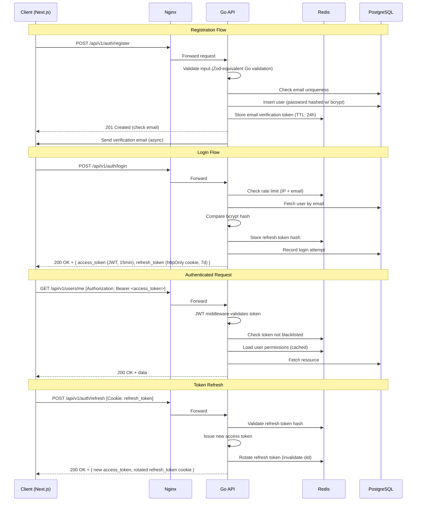

---

## 4.3 Authorization Flow

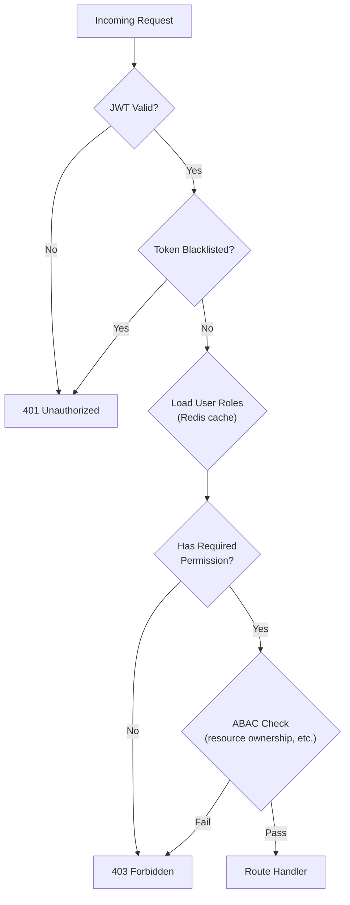

### Middleware Stack (Chi)

```
Request → Logger → CORS → RateLimit → JWT Auth → RBAC Check → ABAC Check → Handler → Audit Log → Response
```

---

## 4.4 Rate Limiting Strategy

| Endpoint Category | Limit | Window | Key |
|---|---|---|---|
| Auth (login, register, reset) | 10 requests | 1 minute | IP |
| Auth (refresh) | 30 requests | 1 minute | User ID |
| API reads (general) | 100 requests | 1 minute | User ID |
| API writes (general) | 30 requests | 1 minute | User ID |
| File upload | 10 requests | 1 minute | User ID |
| Public (campaigns, etc.) | 60 requests | 1 minute | IP |
| AI trigger (ranking) | 5 requests | 5 minutes | User ID |

Implementation: Redis sliding window counter (`INCR` + `EXPIRE`).

---

## 4.5 Error Handling Strategy

### Standard Error Response

```json
{
  "error": {
    "code": "VALIDATION_ERROR",
    "message": "Invalid input data",
    "details": [
      {
        "field": "email",
        "message": "Email is required"
      }
    ],
    "request_id": "req_abc123",
    "timestamp": "2025-01-01T00:00:00Z"
  }
}
```

### Error Codes

| HTTP Status | Error Code | Usage |
|---|---|---|
| 400 | `VALIDATION_ERROR` | Request body validation failed |
| 400 | `BAD_REQUEST` | Malformed request |
| 401 | `UNAUTHORIZED` | Missing or invalid auth |
| 403 | `FORBIDDEN` | Insufficient permissions |
| 404 | `NOT_FOUND` | Resource not found |
| 409 | `CONFLICT` | Duplicate resource |
| 422 | `BUSINESS_RULE_VIOLATION` | Business logic error (e.g., applying after deadline) |
| 429 | `RATE_LIMITED` | Rate limit exceeded |
| 500 | `INTERNAL_ERROR` | Server error (logged, details hidden from client) |

### Request ID
- Every request assigned a unique `X-Request-ID` header (UUID)
- Propagated through all service calls for distributed tracing
- Returned in error responses for support correlation

---

## 4.6 Logging Strategy

### Structured Logging Format (JSON to stdout)

```json
{
  "timestamp": "2025-01-01T00:00:00.000Z",
  "level": "info",
  "request_id": "req_abc123",
  "method": "POST",
  "path": "/api/v1/auth/login",
  "status": 200,
  "duration_ms": 45,
  "user_id": "usr_xyz",
  "ip": "1.2.3.4",
  "user_agent": "Mozilla/5.0...",
  "error": null
}
```

### Log Levels

| Level | Usage |
|---|---|
| `debug` | Detailed internal state (dev only) |
| `info` | Normal operations (request/response, business events) |
| `warn` | Recoverable issues (rate limit hit, validation failure) |
| `error` | Unrecoverable errors (DB connection fail, panic recovery) |

### Log Pipeline

```
Go App (slog) → stdout (JSON) → Docker log driver → Loki/ELK → Grafana dashboards
```

---

# Phase 5 — Frontend Architecture

## 5.1 Folder Structure

```
frontend/
├── public/
│   ├── favicon.ico
│   ├── logo.svg
│   └── locales/
│       ├── ar/
│       │   └── common.json
│       └── en/
│           └── common.json
│
├── src/
│   ├── app/                          # Next.js App Router
│   │   ├── (auth)/                   # Auth layout group
│   │   │   ├── login/
│   │   │   │   └── page.tsx
│   │   │   ├── register/
│   │   │   │   └── page.tsx
│   │   │   ├── forgot-password/
│   │   │   │   └── page.tsx
│   │   │   └── layout.tsx
│   │   │
│   │   ├── (public)/                 # Public layout group
│   │   │   ├── campaigns/
│   │   │   │   ├── page.tsx
│   │   │   │   └── [id]/
│   │   │   │       └── page.tsx
│   │   │   └── layout.tsx
│   │   │
│   │   ├── (dashboard)/              # Authenticated dashboard layout
│   │   │   ├── layout.tsx            # Sidebar + Topbar
│   │   │   ├── page.tsx              # Role-based dashboard home
│   │   │   │
│   │   │   ├── scholarships/
│   │   │   │   ├── page.tsx          # List cycles
│   │   │   │   ├── [cycleId]/
│   │   │   │   │   ├── page.tsx      # Cycle detail
│   │   │   │   │   ├── apply/
│   │   │   │   │   │   └── page.tsx  # Multi-step application form
│   │   │   │   │   ├── applications/
│   │   │   │   │   │   ├── page.tsx  # Admin: list applications
│   │   │   │   │   │   └── [appId]/
│   │   │   │   │   │       └── page.tsx
│   │   │   │   │   └── rankings/
│   │   │   │   │       └── page.tsx
│   │   │   │   └── new/
│   │   │   │       └── page.tsx      # Admin: create cycle
│   │   │   │
│   │   │   ├── housing/
│   │   │   │   ├── page.tsx
│   │   │   │   ├── buildings/
│   │   │   │   ├── applications/
│   │   │   │   ├── allocations/
│   │   │   │   └── maintenance/
│   │   │   │
│   │   │   ├── innovation/
│   │   │   │   ├── page.tsx
│   │   │   │   ├── events/
│   │   │   │   ├── submissions/
│   │   │   │   └── judging/
│   │   │   │
│   │   │   ├── donations/
│   │   │   │   ├── page.tsx
│   │   │   │   ├── campaigns/
│   │   │   │   └── my-donations/
│   │   │   │
│   │   │   ├── finance/
│   │   │   │   ├── page.tsx
│   │   │   │   ├── transactions/
│   │   │   │   ├── budgets/
│   │   │   │   └── expenses/
│   │   │   │
│   │   │   ├── research/
│   │   │   │   ├── page.tsx
│   │   │   │   └── grants/
│   │   │   │
│   │   │   ├── inventory/
│   │   │   │   ├── page.tsx
│   │   │   │   └── assets/
│   │   │   │
│   │   │   ├── notifications/
│   │   │   │   └── page.tsx
│   │   │   │
│   │   │   ├── reports/
│   │   │   │   └── page.tsx
│   │   │   │
│   │   │   ├── admin/
│   │   │   │   ├── users/
│   │   │   │   ├── roles/
│   │   │   │   ├── audit-logs/
│   │   │   │   └── settings/
│   │   │   │
│   │   │   └── profile/
│   │   │       └── page.tsx
│   │   │
│   │   ├── layout.tsx                # Root layout (providers, fonts, dir)
│   │   ├── not-found.tsx
│   │   └── error.tsx
│   │
│   ├── components/
│   │   ├── ui/                       # Design system primitives
│   │   │   ├── button.tsx
│   │   │   ├── input.tsx
│   │   │   ├── select.tsx
│   │   │   ├── modal.tsx
│   │   │   ├── table.tsx
│   │   │   ├── card.tsx
│   │   │   ├── badge.tsx
│   │   │   ├── toast.tsx
│   │   │   ├── tabs.tsx
│   │   │   ├── pagination.tsx
│   │   │   ├── skeleton.tsx
│   │   │   ├── avatar.tsx
│   │   │   ├── dropdown-menu.tsx
│   │   │   ├── data-table.tsx
│   │   │   ├── file-upload.tsx
│   │   │   ├── stepper.tsx           # Multi-step form stepper
│   │   │   ├── stat-card.tsx
│   │   │   ├── chart.tsx             # Recharts wrapper
│   │   │   └── empty-state.tsx
│   │   │
│   │   ├── layout/
│   │   │   ├── sidebar.tsx
│   │   │   ├── topbar.tsx
│   │   │   ├── breadcrumbs.tsx
│   │   │   ├── footer.tsx
│   │   │   └── language-switcher.tsx
│   │   │
│   │   └── features/                 # Feature-specific compounds
│   │       ├── scholarships/
│   │       ├── housing/
│   │       ├── innovation/
│   │       ├── donations/
│   │       └── finance/
│   │
│   ├── hooks/
│   │   ├── use-auth.ts
│   │   ├── use-permissions.ts
│   │   ├── use-debounce.ts
│   │   ├── use-pagination.ts
│   │   └── use-rtl.ts
│   │
│   ├── lib/
│   │   ├── api-client.ts             # Axios/fetch wrapper with interceptors
│   │   ├── auth.ts                   # Token management
│   │   ├── validations/              # Zod schemas
│   │   │   ├── auth.ts
│   │   │   ├── scholarship.ts
│   │   │   ├── housing.ts
│   │   │   └── ...
│   │   ├── utils.ts
│   │   ├── constants.ts
│   │   └── formatters.ts            # Date, currency, number formatters
│   │
│   ├── providers/
│   │   ├── query-provider.tsx        # TanStack Query
│   │   ├── auth-provider.tsx
│   │   ├── theme-provider.tsx
│   │   └── i18n-provider.tsx
│   │
│   ├── services/                     # API service layer (TanStack Query hooks)
│   │   ├── auth.service.ts
│   │   ├── users.service.ts
│   │   ├── scholarships.service.ts
│   │   ├── housing.service.ts
│   │   ├── innovation.service.ts
│   │   ├── donations.service.ts
│   │   ├── finance.service.ts
│   │   └── notifications.service.ts
│   │
│   ├── stores/                       # Zustand stores (minimal — prefer server state)
│   │   ├── ui.store.ts               # Sidebar open, theme, locale
│   │   └── notification.store.ts
│   │
│   ├── types/
│   │   ├── api.ts                    # API response types
│   │   ├── models/
│   │   │   ├── user.ts
│   │   │   ├── scholarship.ts
│   │   │   ├── housing.ts
│   │   │   └── ...
│   │   └── enums.ts
│   │
│   └── styles/
│       └── globals.css               # Tailwind + custom CSS variables
│
├── tailwind.config.ts
├── next.config.ts
├── tsconfig.json
├── .env.local
└── package.json
```

---

## 5.2 Route Structure

| Route Pattern | Layout | Auth Required | Roles |
|---|---|---|---|
| `/login`, `/register`, `/forgot-password` | Auth layout | No | — |
| `/campaigns`, `/campaigns/:id` | Public layout | No | — |
| `/` (dashboard) | Dashboard layout | Yes | All authenticated |
| `/scholarships/**` | Dashboard | Yes | Admin, Scholarship Admin, Student, Judge |
| `/housing/**` | Dashboard | Yes | Admin, Housing Admin, Student |
| `/innovation/**` | Dashboard | Yes | Admin, Student, Judge |
| `/donations/**` | Dashboard | Yes | Admin, Donor |
| `/finance/**` | Dashboard | Yes | Admin, Auditor |
| `/research/**` | Dashboard | Yes | Admin, Researcher |
| `/inventory/**` | Dashboard | Yes | Admin |
| `/admin/**` | Dashboard | Yes | Super Admin, Admin |
| `/reports/**` | Dashboard | Yes | Admin, Module Admins, Auditor |
| `/notifications` | Dashboard | Yes | All authenticated |
| `/profile` | Dashboard | Yes | All authenticated |

---

## 5.3 Layout System

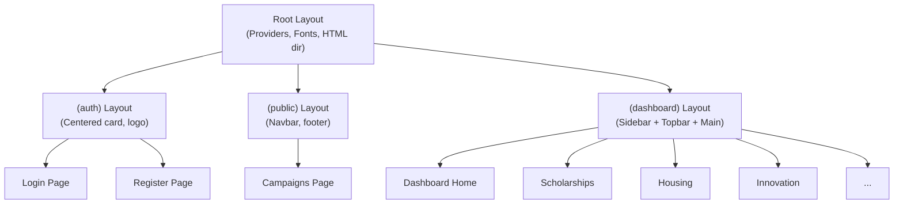

### Dashboard Layout Components

- **Sidebar**: Collapsible; role-aware navigation (only shows modules user has access to); RTL-aware
- **Topbar**: Breadcrumbs, search, notification bell (unread count), user avatar dropdown, language switcher
- **Main Content**: Scrollable area; page-level loading states (Suspense boundaries)

---

## 5.4 Design System

### Design Tokens (CSS Variables + Tailwind)

| Token Category | Examples |
|---|---|
| Colors | Primary (indigo-600), Secondary (emerald-600), Destructive (red-600), Muted, Background, Foreground |
| Typography | Font family (Inter for Latin, Noto Sans Arabic for Arabic), sizes, weights, line heights |
| Spacing | 4px base unit scale |
| Radii | sm (4px), md (8px), lg (12px), xl (16px), full |
| Shadows | sm, md, lg, xl |
| Transitions | fast (150ms), normal (200ms), slow (300ms) |
| Z-index | dropdown (50), modal (100), toast (200) |

### Component Library

Build on **shadcn/ui** pattern — copy-paste components with full customization control. Components adapt to RTL automatically.

### RTL Support

- `dir` attribute set on `<html>` based on locale
- Tailwind `rtl:` variant for directional styles
- Logical properties (`margin-inline-start` instead of `margin-left`)
- Icon mirroring for directional icons (arrows)

---

## 5.5 State Management

| State Type | Solution | Examples |
|---|---|---|
| **Server State** | TanStack Query | All API data — lists, details, mutations, infinite scroll |
| **Form State** | React Hook Form + Zod | Application forms, settings, filters |
| **Client State** | Zustand (minimal) | UI preferences (sidebar collapsed, theme, locale) |
| **URL State** | Next.js searchParams | Pagination, filters, sort, search query |
| **Auth State** | React Context + httpOnly cookie | Current user, permissions |

### TanStack Query Configuration

- `staleTime`: 30 seconds for lists, 5 minutes for static data (roles, categories)
- `gcTime`: 10 minutes
- Automatic refetch on window focus
- Optimistic updates for mutations (mark notification as read, etc.)
- Error boundaries for query failures

---

## 5.6 Authentication Flow (Frontend)

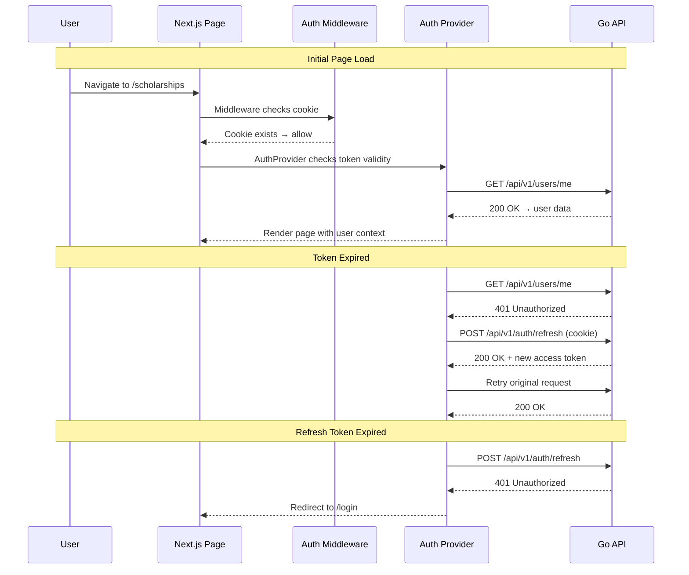

---

## 5.7 Dashboard Architecture

### Role-Based Dashboard Home

Each user role sees a tailored dashboard:

| Role | Dashboard Widgets |
|---|---|
| **Super Admin** | System health, total users, active modules, recent audit logs, alerts |
| **Scholarship Admin** | Active cycles, pending applications, evaluation progress, rankings overview |
| **Housing Admin** | Occupancy rate, pending applications, overdue rent, maintenance queue |
| **Student** | My applications (scholarship + housing), upcoming deadlines, notifications |
| **Judge** | Pending evaluations, completed vs. total, average time per evaluation |
| **Donor** | Total donated, active campaigns, impact summary |
| **Auditor** | Financial overview, recent transactions, budget utilization alerts |

### Widget Pattern

```
DashboardPage
├── StatsRow (4x StatCard)
├── ChartsRow
│   ├── LineChart (trends)
│   └── BarChart (distribution)
├── RecentActivityTable
└── QuickActions
```

---

# Phase 6 — Microservice Architecture

## 6.1 Service Topology

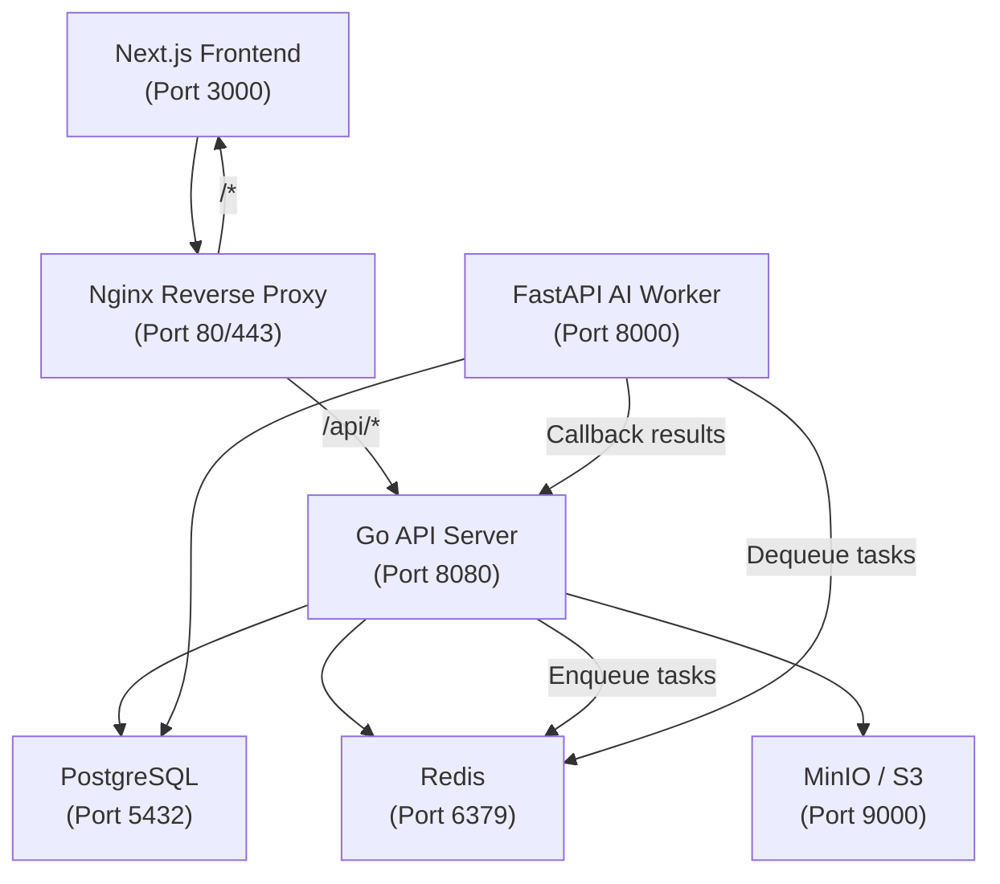

### Service Responsibilities

| Service | Language | Purpose | Scaling Strategy |
|---|---|---|---|
| **Next.js** | TypeScript | SSR + CSR frontend, BFF (Backend for Frontend) | Horizontal (stateless) |
| **Go API** | Go | Core business logic, REST API, auth, RBAC | Horizontal (stateless, shared-nothing) |
| **FastAPI AI** | Python | OCR processing, candidate ranking | Horizontal (worker pool) |
| **PostgreSQL** | — | Primary data store | Primary + read replicas |
| **Redis** | — | Cache, sessions, task queue, rate limiting | Sentinel or cluster |
| **MinIO** | — | File/document storage (S3-compatible) | Standalone or distributed |
| **Nginx** | — | Reverse proxy, TLS termination, static files | Single instance (HA pair in prod) |

---

## 6.2 Communication Patterns

| From → To | Protocol | Pattern | Use Cases |
|---|---|---|---|
| Next.js → Go API | HTTP/REST | Synchronous request/response | All CRUD operations, auth |
| Go API → Redis | Redis protocol | Command/response | Cache reads/writes, rate limits, sessions |
| Go API → PostgreSQL | TCP (pgx) | Connection pool | All data persistence |
| Go API → Redis (Queue) | Redis LPUSH | Async fire-and-forget | Enqueue OCR/ranking tasks, send email jobs |
| FastAPI → Redis (Queue) | Redis BRPOP | Blocking consumer | Dequeue and process AI tasks |
| FastAPI → Go API | HTTP/REST | Callback | Report OCR/ranking results |
| Go API → MinIO | HTTP (S3 API) | Sync upload/download | File storage operations |

---

## 6.3 Key Sequence Diagrams

### 6.3.1 Scholarship Application Submission

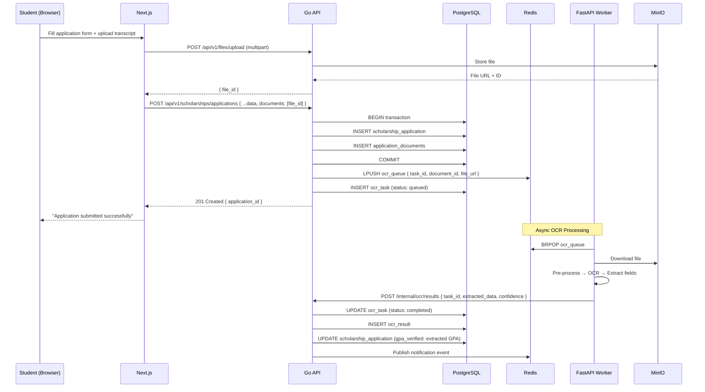

### 6.3.2 AI-Powered Candidate Ranking

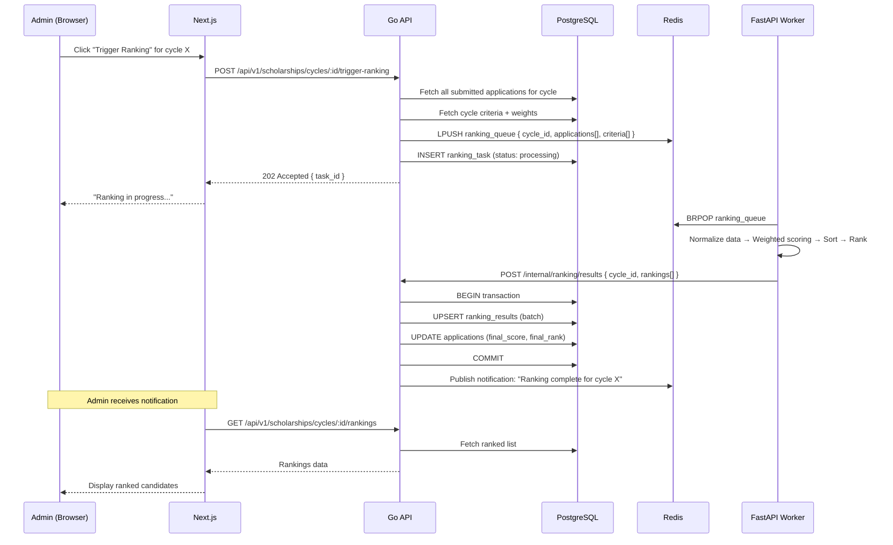

### 6.3.3 Donor Makes a Donation

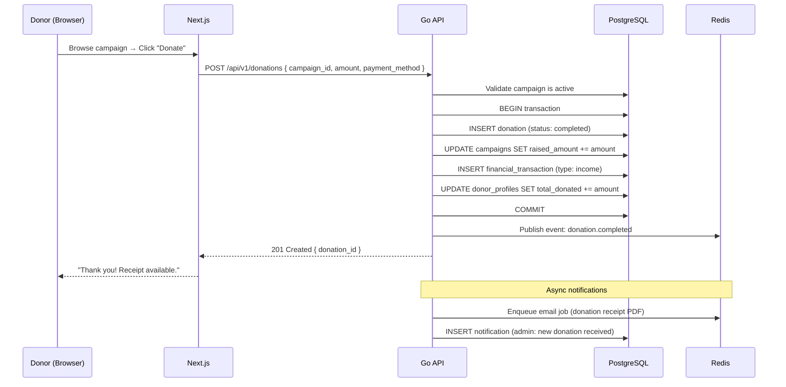

---

## 6.4 Internal API (Service-to-Service)

The FastAPI worker communicates with Go API via internal-only endpoints:

```
/internal/ocr/results          POST   (AI → Go: submit OCR results)
/internal/ranking/results      POST   (AI → Go: submit ranking results)
/internal/health               GET    (health check)
```

These routes are:
- Protected by an internal API key (shared secret via environment variable)
- Not exposed through Nginx (only accessible within Docker network)
- Validated with a dedicated `InternalAuth` middleware

---

# Phase 7 — DevOps

## 7.1 Docker Architecture

### Container Topology

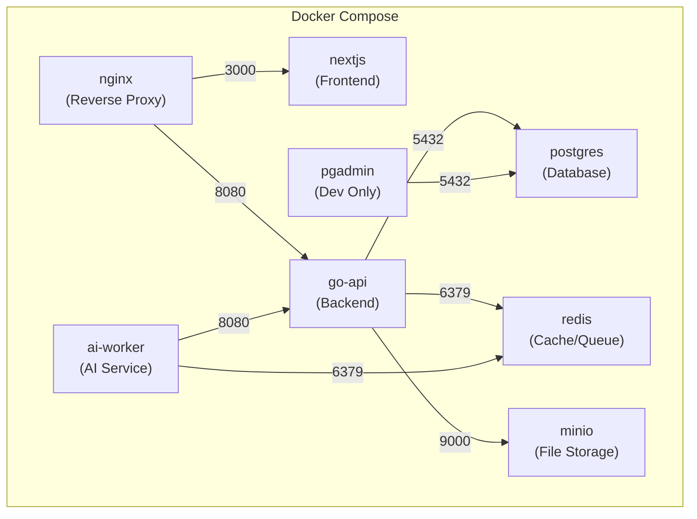

### Docker Compose Services

| Service | Base Image | Build | Volumes | Networks |
|---|---|---|---|---|
| `nginx` | `nginx:alpine` | Config only | `./nginx/nginx.conf` | frontend, backend |
| `nextjs` | `node:20-alpine` | Multi-stage | — | frontend |
| `go-api` | `golang:1.23-alpine` | Multi-stage (final: scratch/distroless) | — | backend |
| `ai-worker` | `python:3.12-slim` | Pip install | — | backend |
| `postgres` | `postgres:16-alpine` | — | `pgdata` named volume | backend |
| `redis` | `redis:7-alpine` | — | `redisdata` named volume | backend |
| `minio` | `minio/minio` | — | `miniodata` named volume | backend |

### Networks

- `frontend`: nginx ↔ nextjs
- `backend`: nginx ↔ go-api ↔ postgres ↔ redis ↔ minio ↔ ai-worker

### Multi-Stage Builds

**Go API Dockerfile** (concept):
1. Builder stage: `golang:1.23-alpine` — compile static binary
2. Final stage: `gcr.io/distroless/static` — ~15MB image, no shell, minimal attack surface

**Next.js Dockerfile** (concept):
1. Deps stage: install node_modules
2. Builder stage: `next build` — generate `.next` output
3. Runner stage: `node:20-alpine` — copy standalone output, ~100MB image

---

## 7.2 CI/CD Pipeline

### GitHub Actions Workflow

```mermaid
graph LR
    subgraph PR["Pull Request"]
        LINT["Lint\n(golangci-lint, eslint)"]
        TEST["Unit Tests\n(go test, vitest)"]
        BUILD["Build Check\n(go build, next build)"]
        SEC["Security Scan\n(govulncheck, npm audit)"]
    end

    subgraph Merge["Merge to main"]
        DBUILD["Docker Build\n(all services)"]
        PUSH["Push to Registry\n(GHCR)"]
        DEPLOY_STG["Deploy to Staging"]
        E2E["E2E Tests\n(Playwright)"]
    end

    subgraph Release["Tagged Release"]
        DEPLOY_PROD["Deploy to Production"]
        NOTIFY["Notify Team"]
    end

    LINT --> TEST --> BUILD --> SEC
    SEC -->|PR Merged| DBUILD
    DBUILD --> PUSH --> DEPLOY_STG --> E2E
    E2E -->|Tag Created| DEPLOY_PROD --> NOTIFY
```

### Pipeline Jobs

| Job | Trigger | Duration (est.) | Actions |
|---|---|---|---|
| **Lint** | PR | 1 min | `golangci-lint run`, `pnpm lint`, `ruff check` |
| **Test** | PR | 3 min | `go test ./...`, `pnpm test`, `pytest` |
| **Build** | PR | 5 min | `go build`, `pnpm build`, `docker build --target=builder` |
| **Security** | PR (weekly) | 2 min | `govulncheck`, `npm audit`, `pip-audit` |
| **Docker Build & Push** | Merge to main | 8 min | Multi-platform build, push to GHCR |
| **Deploy Staging** | Post-push | 3 min | SSH + docker compose pull + up |
| **E2E Tests** | Post-staging | 10 min | Playwright against staging |
| **Deploy Production** | Tag `v*` | 3 min | SSH + docker compose pull + up |

---

## 7.3 Production Deployment

### Deployment Architecture

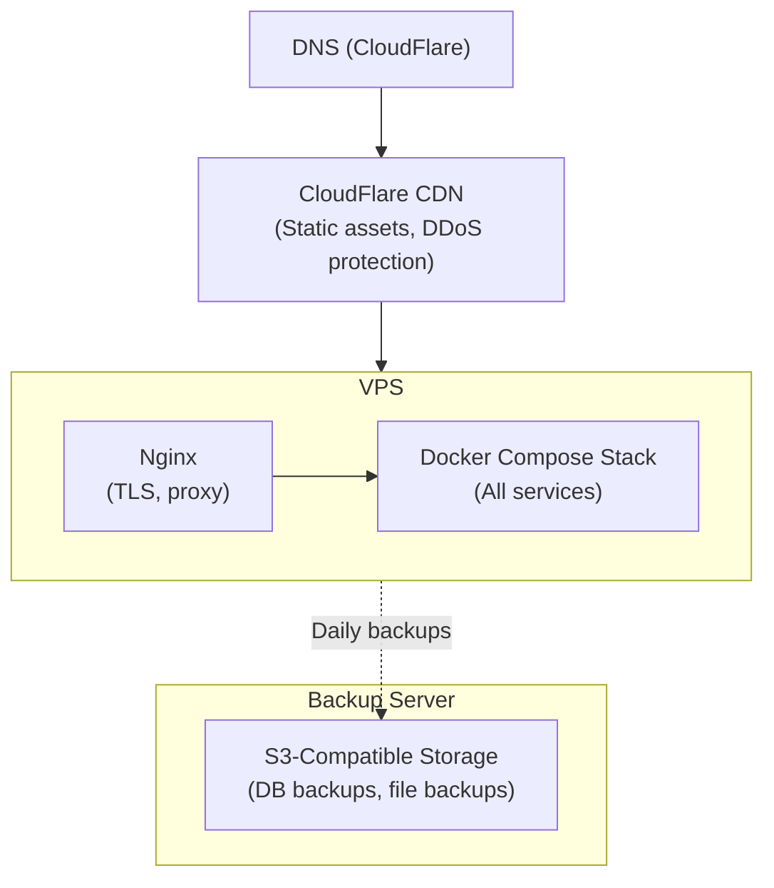

### Deployment Strategy

- **Blue-Green deploys**: Maintain two docker-compose stacks; switch Nginx upstream after health check passes
- **Rolling updates** (alternative for simpler setup): `docker compose pull && docker compose up -d --remove-orphans`
- **Database migrations**: Run via Go migrate tool **before** deploying new API version; backward-compatible migrations only
- **Rollback**: Keep previous Docker images tagged; rollback = point Nginx to previous stack or `docker compose up` with previous image tags

### Environment Configuration

| Environment | Purpose | URL |
|---|---|---|
| **Local (dev)** | Developer workstation | `http://localhost:3000` |
| **Staging** | Pre-production testing | `https://staging.sadaqah.org` |
| **Production** | Live system | `https://app.sadaqah.org` |

---

## 7.4 Monitoring & Observability

### Observability Stack

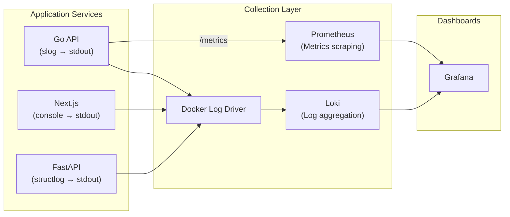

### Metrics (Prometheus)

| Metric | Type | Source |
|---|---|---|
| `http_requests_total` | Counter | Go API (by method, path, status) |
| `http_request_duration_seconds` | Histogram | Go API |
| `db_connections_active` | Gauge | pgx pool |
| `db_query_duration_seconds` | Histogram | pgx |
| `redis_commands_total` | Counter | Go Redis client |
| `ocr_tasks_processed_total` | Counter | FastAPI |
| `ocr_processing_duration_seconds` | Histogram | FastAPI |
| `ranking_tasks_processed_total` | Counter | FastAPI |
| `active_users_gauge` | Gauge | Go API (from Redis sessions) |

### Alerts

| Alert | Condition | Severity |
|---|---|---|
| API Error Rate High | 5xx rate > 5% for 5 min | Critical |
| API Latency High | P95 > 500ms for 10 min | Warning |
| DB Connections Exhausted | Active > 90% of pool | Critical |
| Disk Space Low | < 20% free | Warning |
| OCR Queue Backlog | Queue length > 100 for 15 min | Warning |
| Certificate Expiry | < 14 days to expiry | Warning |

### Health Checks

- `/api/v1/health` — API health (checks DB + Redis connectivity)
- `/internal/health` — Internal health (for Docker HEALTHCHECK)
- Docker Compose: `healthcheck` directives on all services
- Uptime monitoring: External ping (UptimeRobot or similar)

---

## 7.5 Backup Strategy

| Data | Method | Frequency | Retention | Storage |
|---|---|---|---|---|
| **PostgreSQL** | `pg_dump` (full) | Daily 02:00 UTC | 30 days | S3 (encrypted) |
| **PostgreSQL** | WAL archiving | Continuous | 7 days | S3 |
| **Redis** | RDB snapshot | Every 6 hours | 7 days | Local + S3 |
| **MinIO files** | `mc mirror` | Daily 03:00 UTC | 90 days | Secondary S3 |
| **Docker volumes** | Volume backup script | Weekly | 4 weeks | S3 |
| **Configuration** | Git repository | Every change | Indefinite | GitHub |

### Backup Verification

- Weekly automated restore test to staging
- Monthly manual verification of restore procedure
- Backup integrity checksums (SHA-256) logged and verified

---

## 7.6 Disaster Recovery

| Scenario | RTO (Recovery Time Objective) | RPO (Recovery Point Objective) | Procedure |
|---|---|---|---|
| **Service crash** | 1 minute | 0 | Docker auto-restart (`restart: unless-stopped`) |
| **Corrupted deployment** | 5 minutes | 0 | Rollback to previous Docker image tag |
| **Database corruption** | 30 minutes | < 1 hour | Restore from latest pg_dump + WAL replay |
| **Complete server loss** | 2 hours | < 24 hours | Provision new server → restore from S3 backups |
| **Region outage** | 4 hours | < 24 hours | Deploy to alternate region from backup |

### DR Runbook (documented in repo)

1. Assess severity and notify stakeholders
2. Follow scenario-specific procedure above
3. Verify data integrity post-restore
4. Run smoke tests
5. Resume normal operations
6. Post-incident review within 48 hours

---

# Project Structure

## Repository Layout (Monorepo)

```
sadaqah/
├── .github/
│   └── workflows/
│       ├── ci.yml              # PR checks (lint, test, build)
│       ├── staging.yml         # Deploy to staging on merge
│       └── production.yml      # Deploy to production on tag
│
├── frontend/                   # Next.js application
│   ├── src/
│   ├── package.json
│   ├── Dockerfile
│   └── ...
│
├── backend/                    # Go API server
│   ├── cmd/
│   │   └── server/
│   │       └── main.go
│   ├── internal/
│   │   ├── config/             # Configuration loading
│   │   ├── middleware/          # Auth, RBAC, rate-limit, logging, CORS
│   │   ├── handler/            # HTTP handlers (grouped by module)
│   │   │   ├── auth.go
│   │   │   ├── users.go
│   │   │   ├── scholarships.go
│   │   │   ├── housing.go
│   │   │   ├── innovation.go
│   │   │   ├── donations.go
│   │   │   ├── finance.go
│   │   │   ├── research.go
│   │   │   ├── inventory.go
│   │   │   ├── notifications.go
│   │   │   ├── reports.go
│   │   │   ├── files.go
│   │   │   └── admin.go
│   │   ├── service/            # Business logic layer
│   │   │   ├── auth_service.go
│   │   │   ├── user_service.go
│   │   │   ├── scholarship_service.go
│   │   │   └── ...
│   │   ├── repository/         # Data access layer (pgx)
│   │   │   ├── user_repo.go
│   │   │   ├── scholarship_repo.go
│   │   │   └── ...
│   │   ├── model/              # Domain models / DTOs
│   │   │   ├── user.go
│   │   │   ├── scholarship.go
│   │   │   └── ...
│   │   ├── queue/              # Redis queue producer/consumer
│   │   │   ├── producer.go
│   │   │   └── consumer.go
│   │   ├── cache/              # Redis cache helpers
│   │   └── validator/          # Request validation
│   ├── migrations/             # SQL migration files
│   │   ├── 001_create_users.up.sql
│   │   ├── 001_create_users.down.sql
│   │   └── ...
│   ├── go.mod
│   ├── go.sum
│   ├── Dockerfile
│   └── Makefile
│
├── ai-worker/                  # FastAPI AI service
│   ├── app/
│   │   ├── main.py
│   │   ├── config.py
│   │   ├── models/             # Pydantic V2 models
│   │   ├── services/
│   │   │   ├── ocr_service.py
│   │   │   └── ranking_service.py
│   │   ├── workers/
│   │   │   ├── ocr_worker.py
│   │   │   └── ranking_worker.py
│   │   └── utils/
│   ├── requirements.txt
│   ├── Dockerfile
│   └── tests/
│
├── nginx/
│   ├── nginx.conf
│   └── ssl/                    # TLS certs (production)
│
├── docker-compose.yml          # Development
├── docker-compose.prod.yml     # Production overrides
├── .env.example
├── Makefile                    # Top-level commands
└── README.md
```

### Go Backend Architecture Pattern

```
Handler (HTTP) → Service (Business Logic) → Repository (Data Access)
                       ↓
                 Queue Producer (Redis)
```

- **Handler**: Parses HTTP request, validates input, calls service, formats HTTP response
- **Service**: Contains all business logic, orchestrates repositories, enforces business rules
- **Repository**: Pure data access — SQL queries via pgx, no business logic

---

# Development Roadmap

## Sprint Plan (2-week sprints)

### Sprint 1: Foundation (Weeks 1–2)
- [ ] Project scaffolding (monorepo, Docker Compose, CI skeleton)
- [ ] PostgreSQL schema: core tables (users, roles, permissions)
- [ ] Go API skeleton: Chi router, middleware stack, config loader
- [ ] Authentication module: register, login, JWT, refresh, logout
- [ ] Next.js scaffolding: App Router, providers, layout system
- [ ] Auth pages: Login, Register, Forgot Password
- [ ] Design system: Tailwind config, UI components (Button, Input, Card, Table)

### Sprint 2: User Management + Scholarship Foundation (Weeks 3–4)
- [ ] User management: CRUD, role assignment, profile editing
- [ ] Admin user list with search, filter, pagination
- [ ] Scholarship module — Cycle CRUD (admin)
- [ ] Scholarship module — Application form (multi-step, draft save)
- [ ] File upload service (MinIO integration)
- [ ] Document upload for applications
- [ ] Dashboard layout (Sidebar, Topbar, Role-based navigation)

### Sprint 3: Scholarship Complete + OCR (Weeks 5–6)
- [ ] FastAPI AI worker skeleton
- [ ] OCR engine: Tesseract + Arabic support
- [ ] OCR task queue (Redis producer/consumer)
- [ ] OCR results callback and display
- [ ] Evaluation module: Judge assignment, rubric scoring
- [ ] Judges portal frontend
- [ ] Candidate ranking engine (AI worker)
- [ ] Ranking results admin view

### Sprint 4: Student Housing (Weeks 7–8)
- [ ] Housing module: Buildings, Floors, Rooms CRUD
- [ ] Housing application form
- [ ] Room allocation (manual + AI-ranked)
- [ ] Occupancy dashboard
- [ ] Rent payment tracking
- [ ] Maintenance request system
- [ ] Housing violations

### Sprint 5: Innovation & Donors (Weeks 9–10)
- [ ] Innovation events CRUD
- [ ] Project submission form (team management)
- [ ] Innovation judging system
- [ ] Leaderboard + results
- [ ] Campaign management (admin)
- [ ] Public campaign page
- [ ] Donation processing
- [ ] Donor dashboard
- [ ] Donation receipts (PDF generation)

### Sprint 6: Finance, Research, Inventory (Weeks 11–12)
- [ ] Financial transaction ledger
- [ ] Budget management
- [ ] Expense approval workflow
- [ ] Research grant proposal system
- [ ] Research milestones + publications
- [ ] Inventory asset management
- [ ] Asset assignment + maintenance logs

### Sprint 7: Notifications, Reports, Polish (Weeks 13–14)
- [ ] Notification system (in-app + email)
- [ ] Notification preferences
- [ ] Reporting dashboards (per module)
- [ ] PDF/Excel export
- [ ] Analytics (materialized views, charts)
- [ ] RTL support polish
- [ ] Accessibility audit (WCAG AA)
- [ ] Performance optimization

### Sprint 8: Testing, Security, Deployment (Weeks 15–16)
- [ ] E2E tests (Playwright)
- [ ] Security hardening (CSP, rate limiting, CORS)
- [ ] Load testing (k6)
- [ ] Production Docker configuration
- [ ] CI/CD finalization
- [ ] Monitoring setup (Prometheus + Grafana + Loki)
- [ ] Backup automation
- [ ] Production deployment
- [ ] Documentation and runbooks

---

# Complexity Estimates

| Module | Backend Complexity | Frontend Complexity | AI Complexity | Total Effort (person-days) | Priority |
|---|---|---|---|---|---|
| Authentication & Authorization | 🔴 High | 🟡 Medium | — | 12 | P0 |
| User Management | 🟡 Medium | 🟡 Medium | — | 8 | P0 |
| Scholarship Management | 🔴 High | 🔴 High | 🔴 High | 25 | P0 |
| Student Housing | 🔴 High | 🟡 Medium | 🟡 Medium | 18 | P0 |
| Innovation & Conference | 🟡 Medium | 🟡 Medium | — | 12 | P1 |
| Judges Portal | 🟡 Medium | 🟡 Medium | — | 8 | P1 |
| Donor Portal | 🟡 Medium | 🟡 Medium | — | 10 | P1 |
| Financial Auditing | 🔴 High | 🟡 Medium | — | 14 | P1 |
| Research Management | 🟡 Medium | 🟡 Medium | — | 8 | P2 |
| Inventory Management | 🟢 Low | 🟢 Low | — | 5 | P2 |
| OCR Processing (AI) | 🟡 Medium | 🟢 Low | 🔴 High | 10 | P1 |
| Candidate Ranking (AI) | 🟡 Medium | 🟢 Low | 🟡 Medium | 7 | P1 |
| Notifications | 🟡 Medium | 🟡 Medium | — | 8 | P0 |
| Reporting & Analytics | 🟡 Medium | 🔴 High | — | 12 | P2 |
| File & Document Management | 🟡 Medium | 🟢 Low | — | 5 | P0 |
| Audit & Logging | 🟡 Medium | 🟢 Low | — | 4 | P0 |
| **DevOps & Infrastructure** | 🔴 High | — | — | 15 | P0 |
| **Design System & UI Foundation** | — | 🔴 High | — | 10 | P0 |
| **TOTAL** | | | | **~191 person-days** | |

### Team Size Recommendation

| Role | Count | Focus |
|---|---|---|
| Backend Engineer (Go) | 2 | API, services, database, infrastructure |
| Frontend Engineer (React/Next.js) | 2 | UI, design system, dashboards, forms |
| AI/ML Engineer (Python) | 1 | OCR, ranking, FastAPI worker |
| DevOps Engineer | 1 (part-time or shared) | Docker, CI/CD, monitoring, deployment |
| **Total** | **5–6 engineers** | **~16 weeks** |

---

## User Review Required

> [!IMPORTANT]
> **Technology Decisions to Confirm:**
> 1. **Payment Gateway**: Which payment gateway for donations? (Stripe, PayPal, local gateway?)
> 2. **Email Provider**: Which email service? (SendGrid, Mailgun, AWS SES, self-hosted SMTP?)
> 3. **File Storage**: MinIO (self-hosted S3) or cloud S3? Or local filesystem for MVP?
> 4. **OCR Engine**: Tesseract (free, good Arabic support) vs. PaddleOCR (better accuracy, heavier)?
> 5. **Hosting**: VPS (Hetzner, DigitalOcean) or cloud (AWS, GCP)?

> [!IMPORTANT]
> **Scope Decisions:**
> 1. Should the **public-facing campaign pages** be a separate marketing site, or integrated into the main app?
> 2. Is **multi-tenancy** needed (multiple organizations using the same platform)?
> 3. Should the system support **multiple currencies** for international donors?
> 4. Are there **existing systems** that need data migration?
> 5. Is **Arabic the primary UI language** with English as secondary, or should both be equally prioritized?

## Open Questions

> [!WARNING]
> **Architectural Questions:**
> 1. **GPA Scale**: Is 4.0 the universal GPA scale, or do different universities use different scales (e.g., percentage, 5.0)?
> 2. **Scholarship Criteria**: Are the ranking criteria fixed, or should they be fully configurable per cycle? (Currently designed as configurable.)
> 3. **Housing Payment**: Is rent paid directly through the platform, or just tracked? If paid, which payment processor?
> 4. **Certificate Templates**: Should certificate generation use static templates, or do admins need a visual editor?
> 5. **Donor Anonymity**: Should anonymous donations hide donor identity from all admins, or only from public view?
> 6. **Regulatory Requirements**: Are there specific data residency requirements (e.g., data must stay in a specific country)?
